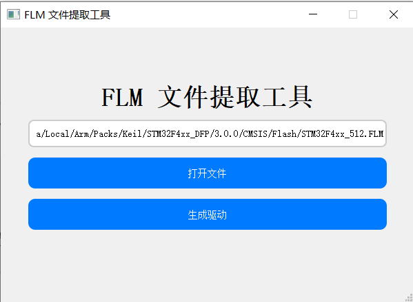
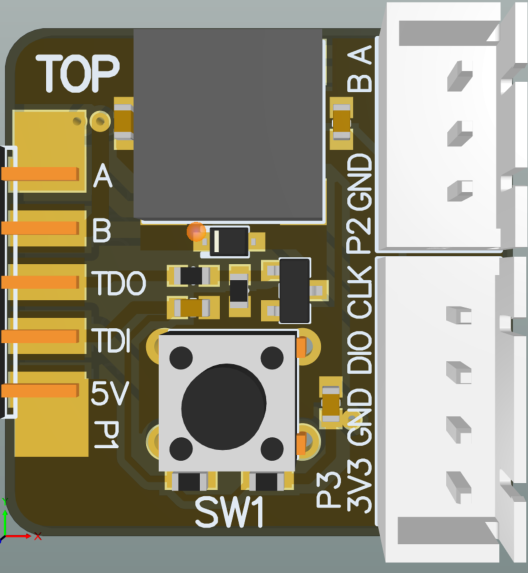
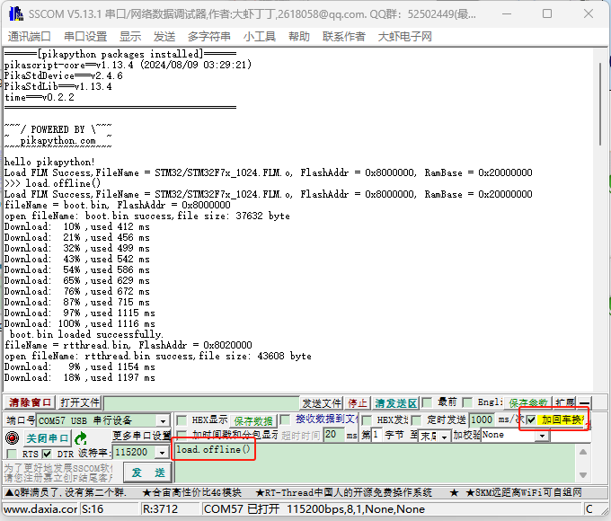
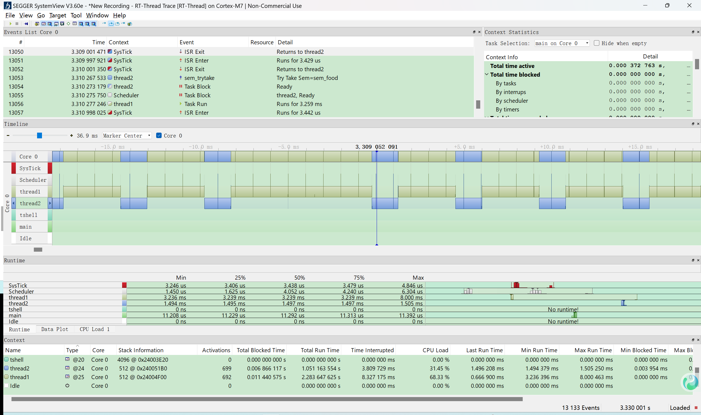

# 开源一个芯片自由的脱机下载器

## 一、脱机下载，也可以是自由的

💡 **什么是脱机下载器？**
简单来说，脱机下载器就是在**不连接电脑、不用专业软件**的情况下，也能帮你把程序烧录进芯片的工具。只要插上电源、按个按钮，固件就自动下载进 MCU，非常适合量产、售后、维修等场景。

🧩 **芯片自由**：适配你想用的芯片

通过加载标准的 **FLM 下载算法文件**（由 Keil Pack 或芯片厂商提供），MicroLink 可以支持几乎所有 Cortex-M 架构的芯片（如 STM32、GD32 等绝大多数国产芯片），包括内置 Flash 和外部 Flash 的烧写。

你无需等待更新固件适配芯片，无需绑定品牌，只要有 FLM 文件，就能烧。

📡 **编程自由**：流程由你定义

MicroLink 支持使用 Python 脚本完整编排脱机烧写过程：

- 烧哪个文件，烧到哪？
- 先烧 Boot，再烧 RTOS，再烧资源包？
- 烧完如何提示烧写成功？
- 不止一个芯片，多个都要写？

全都不是问题。只需写几行 Python脚本，就能完整描述你的烧录流程。

```python
import FLMConfig
import PikaStdLib
import PikaStdDevice
import time

time = PikaStdDevice.Time()
buzzer = PikaStdDevice.GPIO()
buzzer.setPin('PA4') # 蜂鸣器
buzzer.setMode('out')
# 加载FLM 下载算法文件
ReadFlm = FLMConfig.ReadFlm()
result = ReadFlm.load("STM32/STM32F7x_1024.FLM.o", 0x08000000, 0x20000000)
if result != 0:
    return 
# 烧写 app.bin到地址0x08000000
result = load.bin("app.bin", 0x08000000,"rtthread.bin", 0x08020000)
if result != 0:
    return    
# 蜂鸣器响声，表示烧写完成
buzzer.enable()
buzzer.high()
time.sleep_ms(500)
buzzer.low()
time.sleep_ms(500)    
    
```

> 🔧 **MicroLink 内部运行的是 Python 解释器（基于 PikaPython）**，脱机下载脚本会在脚本引擎中逐行执行，就像运行一个嵌入式程序一样灵活。

## 二、芯片自由的背后：如何让下载器不再“认芯片”？

在传统下载器中，“支持某颗芯片”往往意味着厂商写死支持逻辑，用户只能等待官方升级。但 MicroLink 打破了这种封闭方式，**通过动态加载芯片算法 + 脚本控制烧录流程**，实现了真正意义上的“芯片自由”。

我们将这个能力拆解为两个关键部分：

### 📦 1. FLM 算法加载机制：让下载器“学会”支持芯片

MicroLink 不内置任何芯片写死的支持代码，而是通过加载 Keil MDK 或芯片原厂提供的 **FLM 下载算法（Flash Loader）** 文件来完成烧录。

FLM 是一种标准化的芯片 Flash 编程算法格式，通常来自官方 Pack 包，包含以下核心内容：

- **Init**：芯片初始化代码（打开电源、时钟等）
- **Erase/Program**：擦除/写入 Flash 的函数
- **Sector Info**：每个 Flash 页的大小、布局等元信息

**🔍 IDE 是如何用 FLM 文件下载固件的？**

在 Keil、IAR 等 IDE 中，固件下载流程大致如下：

1. **选择芯片或目标板**：IDE 会根据芯片型号自动关联对应的 FLM 文件。
2. **加载 FLM 到 RAM**：IDE 把 FLM 算法文件中的代码段加载进目标 MCU 的 RAM。
3. **跳转执行**：通过调试接口（如 SWD），IDE 控制 MCU 跳转执行 FLM 中的 Init、Erase、Program 等函数。
4. **写入用户固件**：IDE 将用户编译好的 bin 文件，通过 FLM 算法完成 Flash 编程。

简单来说，IDE 并不是“自带”所有芯片的烧录代码，而是 **动态加载** FLM 算法，把烧录这件事交给芯片本身的 RAM 里执行。MicroLink 就复用了这套机制，使你不需要写适配代码，也能支持任意芯片。

📁 **FLM 文件获取方式：**

- 从 Keil MDK 安装路径中提取（通常在 `Keil\ARM\Flash`）
- 从芯片厂商提供的 Pack 包中提取
- 使用 MicroLink 提供的 **FLM 提取工具**一键导出为 `.FLM.o` 格式



> ⚠️ 注意：不同芯片型号可能对应不同的 FLM 文件，请确认地址和容量匹配。

**MicroLink 如何利用 FLM 实现烧录？**

1. **解析 FLM 文件**（.FLM.o）：提取必要代码段，减小FLM文件尺寸

2. **将代码加载进 MCU RAM**：作为“动态烧录器”运行
3. **通过调用烧录函数**：实现对目标芯片 Flash 的操作
4. **一颗芯片支持多个区域（如主 Flash + 外部 SPI Flash）**：可以加载多个 FLM 文件分别处理

这个过程中，MicroLink 自己并不关心芯片型号，只需要：

- 有合适的 FLM 算法
- 知道 Flash 起始地址
- 有合适的下载数据（bin）

> 这就像是“把芯片支持交给算法提供者”，MicroLink 只负责执行和协调。

### 💡 2. Python 脚本控制机制：让烧录流程更聪明

有了 FLM 算法，接下来是：**如何控制整个烧录流程**？例如，先烧 boot，再烧 app，再烧外挂 Flash，再提示成功。

传统脱机下载器往往只支持烧一个文件，流程固定。而 MicroLink 提供了完整的 Python 脚本接口，允许用户自己用代码定义“烧录流程”。

示例脚本：

```python
import FLMConfig
import PikaStdLib
import PikaStdDevice
import time

time = PikaStdDevice.Time()
buzzer = PikaStdDevice.GPIO()
buzzer.setPin('PA4') # 蜂鸣器
buzzer.setMode('out')

ReadFlm = FLMConfig.ReadFlm()
# 加载第一个 FLM 下载算法文件
result = ReadFlm.load("STM32/STM32F7x_1024.FLM.o", 0x08000000, 0x20000000)
if result != 0:
    return 

# 烧写 boot.bin和rtthread.bin
result = load.bin("boot.bin", 0x08000000,"rtthread.bin", 0x08020000)
if result != 0:
    return 

# 加载外部 Flash 的 FLM 下载算法文件
result = ReadFlm.load("STM32F767_W25QXX.FLM.o", 0x90000000, 0x20000000)
if result != 0:
    return 

# 烧写 HZK.bin
result = load.bin("HZK.bin", 0x90000000)
if result != 0:
    return 
# 蜂鸣器响一声，表示烧写完成
buzzer.enable()
buzzer.high()
time.sleep_ms(500)
buzzer.low()
time.sleep_ms(500)
```

该脚本通过加载FLM算法文件，将多个二进制文件（如boot.bin、rtthread.bin和HZK.bin）分别烧录到STM32内部和外部Flash中，并通过蜂鸣器响声提示烧录完成。

> **注意：**请根据您的实际项目需求，修改以下内容：
>
> - **下载算法文件名称**（如 `"STM32/STM32F7x_1024.FLM.o"` 和 `"STM32F767_W25QXX.FLM.o"`）：应替换为对应芯片和Flash型号的 FLM 文件。
> - **BIN 文件名称及地址**（如 `"boot.bin"`、`"rtthread.bin"`、`"HZK.bin"` 及其对应的地址）：请确保文件名和烧录地址与您的程序结构一致。
>
> 若文件名或地址设置不当，可能导致程序无法正常运行或烧录失败。

🧭 **脚本的作用是：**

- **按需加载多个 FLM 算法**（多片 Flash）
- **灵活控制烧写顺序与文件分布**
- **添加控制逻辑：判断、日志输出、状态指示**
- **控制外设：比如烧写成功后蜂鸣器响一下**
- **未来可扩展逻辑判断、加密校验等功能**

> MicroLink 的烧录逻辑不是固定的，而是**被你编写出来的**。

这相当于赋予了创客一个高度自由的平台，让你可以自己定义烧录策略，而不是被工具的“支持列表”所限制。

### 🎯 3. 如何使用脱机下载功能？

了解原理之后，我们来看 MicroLink 的脱机下载功能如何实际使用。**整个流程非常简单**，不需要专业软件、不依赖电脑，就可以完成整套烧录动作。

**✅ 第一步：准备 FLM 算法文件与烧录脚本**

你只需将以下文件拷贝到 MicroLink 的脱机下载目录中（类似 U 盘的文件夹）：

| 文件名                | 作用                                                         |
| --------------------- | ------------------------------------------------------------ |
| `*.FLM.o`             | FLM 下载算法文件（支持多个），可以利用**FLM文件提取工具**生成 |
| `*.bin`               | 需要烧录的固件文件                                           |
| `offline_download.py` | 控制烧录流程的 Python 脚本（必须）                           |

示例目录结构：

```
/MICROLINK/
│
├── offline_download.py
├── STM32F7x_1024.FLM.o
├── STM32F767_W25QXX.FLM.o
├── boot.bin
├── rtthread.bin
└── HZK.bin
```

------

**✅ 第二步：触发脱机下载（两种方式）**

MicroLink 支持两种脱机烧录触发方式：

**🔘 方式一：按键触发**

搭配专用脱机下载扩展板，板上有下载按钮和蜂鸣器。

- **按下按钮** → MicroLink 自动执行 `offline_download.py` 脚本
- **烧录成功** → 蜂鸣器响声提示用户
- **可用于量产、售后维修、断网环境**

> 纯离线运行，不依赖上位机。

------



**💻 方式二：串口命令触发**

如果 MicroLink 已连接电脑，你可以通过 USB CDC 虚拟串口发送`load.offline()`加回车，效果如下：



该命令会立即触发一次离线脚本的执行，适合：

- 测试脚本是否正确
- 在工控系统中集成自动烧录流程
- 将离线流程作为可控子模块远程触发

------

> 📝 提示：你也可以通过脚本打印状态、控制 GPIO、反馈结果到串口等，方便上位机交互。

### 💾 4. 如何使用拖拽下载功能？

MicroLink 上电后，会自动运行内部脚本 `drag_download.py`，该脚本会加载对应芯片的拖拽下载算法。例如：

```python
import FLMConfig
ReadFlm = FLMConfig.ReadFlm()
res1 = ReadFlm.load("STM32/STM32F7x_1024.FLM.o", 0x08000000, 0x20000000)
```

此过程会将指定的 FLM 文件加载进内存，并初始化烧录所需的相关信息。随后，MicroLink 会持续监听 U 盘文件系统中的文件变化，一旦检测到有新的 `.bin` 文件写入，即自动启动烧录流程。

**烧录流程说明：**

- 当用户将固件文件拖入 U 盘时，MicroLink 实际会将写入的数据**实时转发至目标芯片的 SWD 接口**，并直接开始烧录。
- 烧写过程中，MicroLink 板上的 **LED 会持续闪烁**，表示正在进行拖拽下载。
- 烧录完成后，MicroLink 会通过 SWD 向目标芯片发送 **复位指令**，自动让单片机复位。
- 此时用户可以通过板子上的运行状态、串口打印等手段**确认新程序是否成功运行**。

⚠️ 需要注意的是，从用户角度看，“拷贝文件进 U 盘”这个动作，其实就是完整的烧录过程，因此**不需要额外点击按钮或运行其他软件**。

> 💡 **拖拽烧录是如何实现的？**
> MicroLink 会监听 U 盘中是否有新文件写入，并自动执行对应的下载脚本。你无需点按钮，直接拖进去 bin 文件即可。

**适用场景：**

- 用户无需安装任何软件，**即插即用**。
- 操作直观、体验友好，适合研发、产线及售后场景。
- 拖拽下载功能完全独立于芯片型号，实现了真正的**芯片自由**。

## 三、给创客的自由：把“下载器”变成“工具箱”

MicroLink 不是一个封闭的烧录盒，而是一个开放的工具平台。它支持：

#### 🚀 1、高速在线下载与调试（CMSIS-DAP 接口）

MicroLink 支持高速在线烧录与调试，使用 CMSIS-DAP 协议，底层优化加速引擎使得 **下载速度与调试响应明显优于传统 DAPLink**。无需忍受慢速 Flash 编程，开发体验更顺畅。

#### 🔄 2、在线/脱机无缝切换

你可以在开发阶段使用 **在线下载**快速验证，在量产阶段直接切换到 **脱机脚本烧录**，无需切换工具，一站到底。**MicroLink = 开发 + 量产 + 售后，一机搞定。**

#### ⚡ 3、USB 转串口：支持高达 10Mbps 波特率

内置 USB 转串口模块，波特率最高支持 **10Mbps**，远超常规工具。这意味着：

- 下载日志不丢字；
- 串口通信不卡顿；
- 适配高速设备调试/通信需求。

#### 🛰️ 4、内置 RTT，支持任意串口助手替代RTTView上位机

MicroLink 支持直接转发 RTT 数据（基于 SEGGER RTT 协议）至主机，通过串口即可与 **Xshell、Termite VOFA等串口助手**兼容交互。实现以下功能：

- MCU 实时输出调试信息；
- 主机发送命令并快速响应；
- 无需外接调试器，也无需复杂配置。

甚至，你可以把 RTT 与shell等命令行工具结合，在脚本中嵌入设备状态上报、日志输出等功能，打造更“聪明”的调试工具。

#### 📊 5、实时可视化调试支持：SystemView 助你掌控运行态

除了支持在线与脱机烧录，MicroLink 现在还加入了 **SEGGER SystemView 协议支持**，让你可以在**无需额外硬件**的情况下，轻松进行任务级别的运行态分析与可视化调试。

MicroLink 会将目标设备中 RTOS（如 RT-Thread、FreeRTOS）产生的 SystemView 日志数据通过 **RTT 协议**采集，并通过 USB CDC 虚拟串口转发给 PC。

✅ 使用方式：

1. 在 MCU 中启用 SEGGER RTT 和 SystemView 支持（支持 RT-Thread、FreeRTOS 等常见 RTOS）
2. 发送启动SystemView 指令，MicroLink 会开启自动侦测 RTT UpBuffer 并将数据透传
3. 在 PC 上打开 SystemView 工具，选择对应串口，即可实时查看运行状态

**启动SystemView 功能：**打开任意串口助手，输入以下指令：

```python
SystemView.start(0x20000000,1024,1)
```

- 0x20000000:搜索RTT控制块的起始地址；
- 1024：搜寻RTT控制块地址范围大小
- 1：SystemView使用RTT的通道

📌 示例画面：



#### 📂 6、拖拽烧录：让烧写像拷文件一样简单

通过 MicroLink 的**任意芯片拖拽下载功能**，你可以将 `.bin` 文件直接拖进 U 盘盘符，设备会根据当前配置的 FLM 算法与脚本，**自动识别芯片、地址并完成烧录**。

这意味着：

- 烧录只需「拖进去」；
- 支持任意芯片（只要有 FLM 算法）；
- 可搭配自动化脚本，实现智能判断和校验。

#### 🧰 一台设备，多种身份

总结一下，**MicroLink = 脱机下载器 + 在线调试器 + USB 转串口 + RTT 通信 + SystemView +拖拽烧录 + 用户可编程自动化工具**。MicroLink 不只是下载器，更是你打造智能嵌入式工作流的利器。

| 功能                    | 使用场景                       |
| ----------------------- | ------------------------------ |
| ✅ 脱机下载              | 工厂烧写、售后维护             |
| ✅ 在线下载/调试         | 开发阶段快速验证               |
| ✅ USB转串口（10Mbps）   | 日志收集、高速通信             |
| ✅ RTT 转UART            | 实时调试、远程诊断             |
| ✅ SystemView            | RTOS运行态分析与可视化调试     |
| ✅ 拖拽烧录              | 简化操作，适配量产与非工程用户 |
| ✅ Python 脚本自动化流程 | 高度定制的烧录策略与交互控制   |

> 从开发到量产，从调试到通信，MicroLink 将所有工具集于一身，让创客拥有前所未有的开发自由。

## 四、未来展望：不断扩展功能，打造工程师手边真正好用的工具

### ✅ 1. 更丰富的 Python API（在持续开发中）

目前，脱机下载脚本支持的功能已经能覆盖基本需求，如加载 FLM 算法、烧录 bin 文件、控制 GPIO、延时等。

但在实际生产和调试场景中，很多工程师希望能够做得更多。因此计划逐步增加以下常用的API接口：

- 🔓 Flash 解锁 / 上锁
- 📥 Flash/RAM 任意地址数据读写
- 🔢 Flash序列号 / 滚码写入

### 💻 2. 项目开源，持续更新

你可以在 GitHub 上查看全部代码、硬件设计、使用说明和范例脚本：

🔗 GitHub 项目地址：
 👉 https://github.com/Aladdin-Wang/MicroLink

欢迎你提出建议、反馈 bug，甚至直接提交 PR。
 我们不求大而全，只求把每一个功能打磨得扎实、可靠、好用。

### 🛒 3. 淘宝购买链接

如果你想支持这个项目，也欢迎购买 MicroLink 实体设备：

🔗 淘宝购买链接：
 👉 https://item.taobao.com/item.htm?ft=t&id=895964393739

包括主板、扩展板、TypeC数据线、说明文档等内容。

### ❓ 4 .常见问题答疑（FAQ）

为了帮助用户更快上手和排查问题，我们整理了使用 MicroLink 脱机下载功能时的一些常见问题与解答：

| 问题                                        | 解答                                                         |
| ------------------------------------------- | ------------------------------------------------------------ |
| 💡 FLM 文件从哪里获取？                      | 可从 Keil MDK 安装目录（通常在 `Keil\ARM\Flash`）或芯片厂商提供的 Pack 包中提取，然后使用 MicroLink 提供的 FLM 提取工具生成 `.FLM.o` 文件。 |
| 📂 我只有 bin 文件，没有 FLM，怎么办？       | 建议使用 Keil 安装包或厂商资源获取 FLM，也可以借助他人共享的兼容 FLM 文件。我们未来也计划支持开源算法标准或社区共建资源库。 |
| 🔄 脱机脚本可以烧录多个文件吗？              | 可以，Python 脚本中你可以按需加载多个 bin 文件、写入不同地址，还可操作多个 Flash 区域。 |
| 🧪 烧录失败了怎么办？可以调试脚本吗？        | 可以。你可以通过串口连接 MicroLink，使用 `load.offline()` 命令手动触发脚本执行，并通过输出调试信息来定位问题。 |
| 📦 脱机脚本能控制哪些外设？                  | 可以控制 GPIO、电平翻转、蜂鸣器响声、串口交互、延时、打印日志等，用于丰富脱机过程的交互与状态反馈。 |
| 🚦 如何判断烧录成功？                        | 烧录完成后 MicroLink 会自动鸣响蜂鸣器作为提示，也可以在脚本中自定义 LED 灯亮灭或串口发送完成信号。 |
| 📦 一台 MicroLink 能脱机烧录多个不同芯片吗？ | 可以。只需准备好对应芯片的 FLM 文件和脚本，MicroLink 脱机运行时会根据文件自动判断和加载，无需更换工具。 |