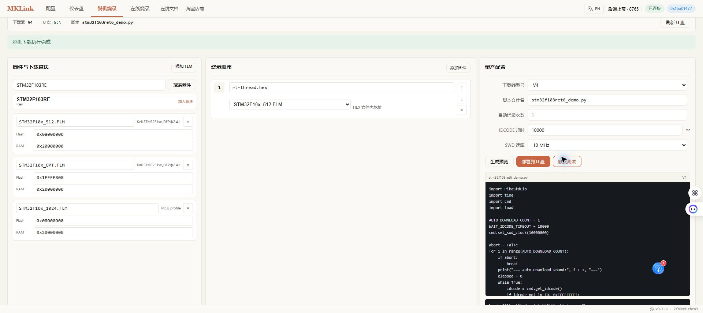
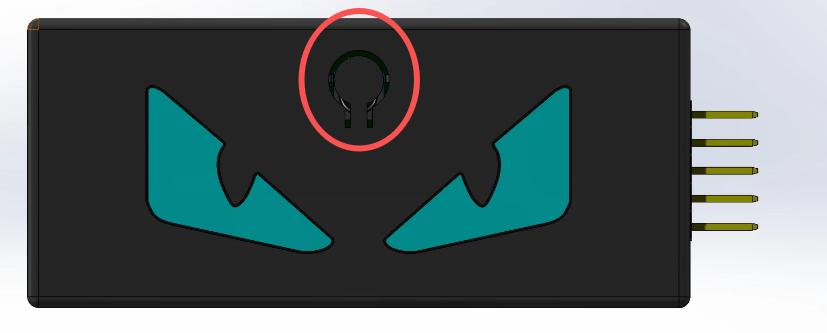
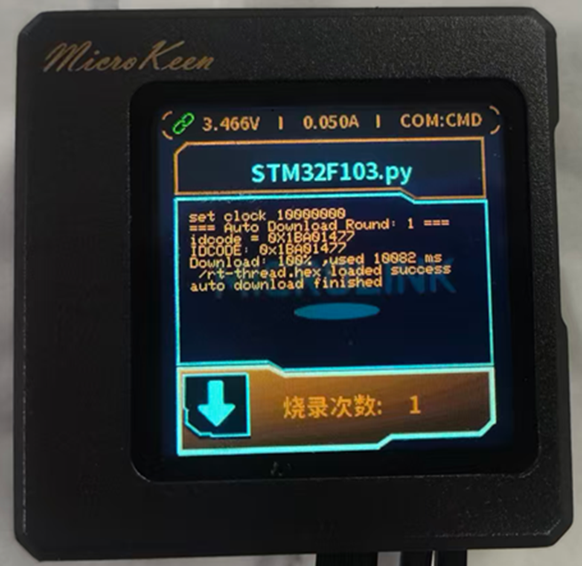

# 脱机下载与量产

> 本页介绍 Web GUI 手动部署和触发。自动部署流程见[嵌入式 AI 部署脱机下载](../../AI/offline-workflow.md)。

脱机下载将固件、Flash 算法和执行脚本保存到 MKLink。部署完成后，下载器不再依赖 PC 软件，可以通过外壳按键、机台引脚或 Web GUI 的“触发测试”完成烧录。

它适合小批量生产、返修工位和现场升级。研发阶段仍建议先完成一次[在线烧录](online-flash.md)，确认器件、固件地址和运行结果都正确，再生成脱机任务。

## 工作过程

```text
选择器件和 FLM -> 加入 HEX/BIN -> 设置量产参数 -> 生成预览
        -> 部署到 MICROKEEN -> 触发烧录 -> 读取结果 -> 验证程序运行
```

“部署成功”只表示文件已经写入下载器；“触发完成”只表示脚本运行结束。量产任务还必须检查 `loaded success`、`auto download finished`，并至少通过版本号、RTT、通信响应或板级行为确认新固件运行。

## 开始前检查

- 目标芯片精确型号和供电电压已经确认；
- HEX/BIN 来自已通过构建和在线验证的配置；
- BIN 已知准确的 Flash 基地址；HEX 的地址保存在文件内部；
- 非 HPM 目标有覆盖固件地址范围的 FLM；
- BootLoader、参数区和应用程序的擦写范围不会互相覆盖；
- MKLink U 盘卷标为 `MICROKEEN`，Web GUI 已显示后端正常。

!!! warning "先停止其他探针任务"
    RTT、SuperWatch、RTOS Trace 和在线烧录会占用相同的目标调试资源。部署可以在 U 盘可用时完成，但触发前应正常停止其他会话。

## 使用 Web GUI 部署

打开“脱机烧录”，页面按工作流分成三个区域。

### 1. 选择器件和算法

在“器件与下载算法”中搜索精确器件，例如 `STM32F103RE`。页面会列出来自已安装 CMSIS-Pack、MCU Profile 和下载器 U 盘的算法。

本案例选择：

| 参数 | 值 |
|---|---|
| 目标器件 | `STM32F103RE` |
| Flash | 512 KiB，`0x08000000` 起始 |
| 下载算法 | `STM32F10x_512.FLM` |
| FLM RAM 基址 | `0x20000000` |

不要因为名称相近而选择 `STM32F10x_OPT.FLM`。它用于选项字节，不用于应用固件。

### 2. 添加固件和烧录顺序

把 HEX 或 BIN 拖入“烧录顺序”。多镜像工程按实际地址和依赖排列，例如：

1. BootLoader；
2. 参数或资源镜像；
3. Application。

每个固件必须绑定正确的 FLM。BIN 还需要填写基地址；地址未知时停止，不要试烧。HEX 可在预览中核对实际数据范围。

### 3. 设置量产参数

| 参数 | 建议 | 说明 |
|---|---|---|
| 下载器型号 | 按实物选择 | V2/V3 使用固定脚本名；V4 可自定义 |
| 脚本文件名 | 能识别项目和版本 | V4 示例为 `stm32f103ret6_demo.py` |
| 自动烧录次数 | 首次测试设为 1 | 连续生产前再调整 |
| IDCODE 超时 | 10000 ms | 等待目标接入或断开的最长时间 |
| SWD 速率 | 从 1 MHz 起验证 | 线短且信号稳定后可提高到 10 MHz |

先点击“生成预览”。检查脚本中的 FLM、固件名、地址、顺序和循环次数，再点击“部署到 U 盘”。页面应列出实际写入的所有文件。



## STM32F103RET6 实测

本次演示使用 `STM32F103RET6` 和 RT-Thread 固件。构建产物为 `rt-thread.hex`，下载算法为 `STM32F10x_512.FLM`。

部署结果：

```text
model: V4
script: stm32f103ret6_demo.py
files:
  rt-thread.hex
  FLM/STM32F10x_512.FLM
  python/stm32f103ret6_demo.py
```

点击“触发测试”后，上位机实际发送：

```text
load.offline("Python/stm32f103ret6_demo.py")
set clock 10000000
=== Auto Download Round: 1 ===
fileName rt-thread.hex
Download: 100% ,used 10102 ms
/rt-thread.hex loaded success
auto download finished
```

## HPM5301 ROM API 脱机实测

HPM 脱机任务不需要 FLM。实测配置为：

| 参数 | 值 |
|---|---|
| 目标 | `HPM5301xEGx` |
| 板型 | `hpm5301evklite` |
| 固件 | `demo.bin`，55,432 字节 |
| 基址 | `0x80000400` |
| 脚本 | `hpm5301_freertos_demo.py` |

生成预览后检查脚本包含：

```python
hpm.board("hpm5301evklite")
hpm.program("demo.bin", 0x80000400)
```


本次部署前后均核对了固件大小和 SHA-256。点击“触发测试”后，设备端日志显示文件大小 55,432 字节，下载到 100%，最终返回：

```text
demo.bin loaded successfully.
auto download finished
```


## 不连接电脑时如何触发

### V3 / V4 按键

目标板接线和供电确认后，按下下载器外壳按键。执行期间不要拔线或切断目标电源。以显示、指示灯或生产工装返回信号判断结果。





### V2 机台引脚

V2 不带独立按键。机台可通过 TDI 与 GND 触发，TDO 用于输出成功/失败提示。接入工装前确认电平、上拉和触发脉宽，避免浮空输入造成误烧录。

### Web GUI 触发测试

研发阶段优先使用“触发测试”。它会显示设备端实时输出，适合验证脚本、算法和接线。通过后再转为按键或工装触发。

## 连续量产

连续烧录不是简单增大循环次数。工位应完成以下设计：

- 等待有效 IDCODE 后才开始；
- 每台下载完成后等待目标断开，再接受下一台；
- 记录固件版本、SHA-256、脚本名、下载器固件版本和结果；
- 失败后停止当前循环并保留日志，不自动跳过；
- 对 BootLoader、密钥区和选项字节使用独立权限与复核流程；
- 定期抽检目标启动、通信和业务功能。

## 常见失败

| 现象 | 排查顺序 |
|---|---|
| 未发现 MICROKEEN | 检查 USB 数据线、磁盘卷标和系统挂载状态 |
| 找不到目标算法 | 核对精确器件，安装对应 Pack，或导入厂家 FLM |
| 等待 IDCODE 超时 | 检查目标供电、Vref、GND、SWDIO、SWCLK 和 NRST |
| `load flm failed` | 检查 FLM 文件完整性、Flash/RAM 基址和器件系列 |
| BIN 下载后不启动 | 优先核对 BIN 基址、向量表和 BootLoader 跳转地址 |
| 显示 100% 但程序不运行 | 检查 verify、复位方式、启动脚、选项字节，并做 RTT/通信复验 |
| 连续模式卡住 | 判断正在等待目标接入还是等待上一目标断开 |

## 使用 AI 协助

AI 提示词保持任务化即可：

> 为 STM32F103RET6 生成并部署单次脱机任务。执行前报告固件、FLM、地址和摘要。

AI 应在部署前报告目标器件、文件摘要和擦写范围；触发失败时保留原始日志，不静默改用其他烧录后端。

下一步可阅读 [固件升级](firmware-upgrade.md) 或 [下载器内部 Python API](python_api.md)。
