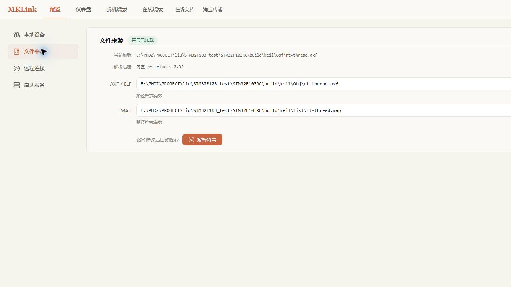

# 配置第一个工程

## 本页目标

让 Web GUI 知道工程目录、MKLink 设备以及 AXF/ELF、MAP 文件的位置，为 RTT、符号变量、内存和 SystemView 共用同一份配置。

## 连接硬件

连接 `SWDIO`、`SWCLK`、`GND`，需要复位控制时再连接 `RST`。目标板已有供电时不要重复从下载器供电；使用 VCC 输出前先确认目标板允许的电压。

## 选择工程

打开“配置”页面：

1. 选择工程根目录；
2. 在“本地设备”中保持“自动搜索”，或选择确认过的 MKLink 端口；
3. 从较低的 SWD 时钟开始，例如 1 MHz；
4. 选择 AXF/ELF 符号文件和 MAP 文件；
5. 点击“连接设备”。

配置修改后会自动保存。AXF/ELF 用于变量类型、源码行和 HardFault 解析；MAP 可用于 RTT 控制块地址发现。二者不是固件镜像，不能替代 BIN/HEX 烧录文件。

## STM32F103RET6 示例工程

本文使用一个 RT-Thread 工程演示，实际目标为 `STM32F103RET6`。该器件属于 STM32F103 高密度系列，片上资源为 512 KiB Flash 和 64 KiB SRAM。

| 配置项目 | 本教程要求 |
|---|---|
| Keil Device | `STM32F103RE`，对应 RET6 的 Keil DFP 设备条目 |
| Flash Algorithm | `STM32F10x_512.FLM` |
| Flash 地址范围 | `0x08000000` 起，最大 512 KiB |
| SRAM 地址范围 | `0x20000000` 起，最大 64 KiB |

Keil 的 DFP 将 `STM32F103RET6` 归入 `STM32F103RE` 设备条目。工程目录名不是器件型号，执行烧录前应核对板上丝印、Keil Device、Flash Algorithm 和链接脚本。

## 成功判据

- “本地设备”显示已连接；
- 仪表盘连接按钮变为“断开”；
- AXF/ELF 能解析出符号目录；
- RTT 或 RTOS Trace 的“自动搜索”可以使用符号文件定位控制块。

本示例当前构建结果为：Code 约 94.7 KiB，RO-data 约 20.4 KiB，RW-data 约 2.5 KiB，ZI-data 约 34.6 KiB。配置文件来源时应选择 `build/keil/Obj/rt-thread.axf` 和 `build/keil/List/rt-thread.map`，不要误选工程根目录中的旧产物。

!!! warning "不要公开本机信息"
    分享截图前隐藏完整 COM 号、探针唯一 ID、用户名、工程绝对路径和远程 Token。

下一步：[在线编译与烧录](online-flash.md)。
