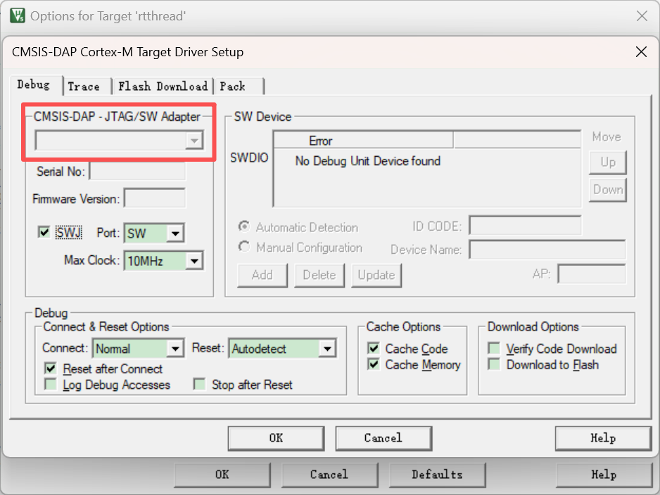
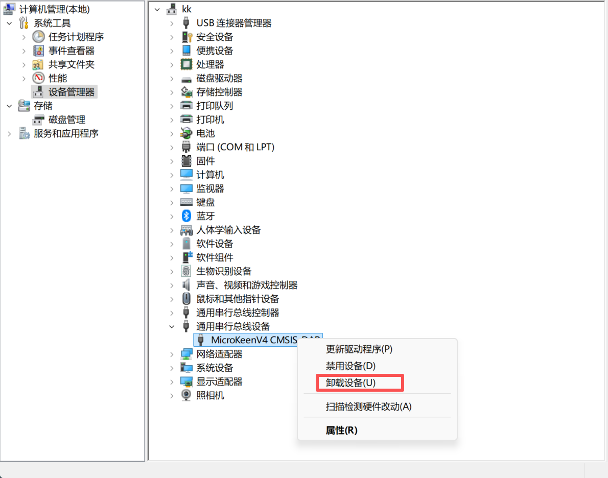
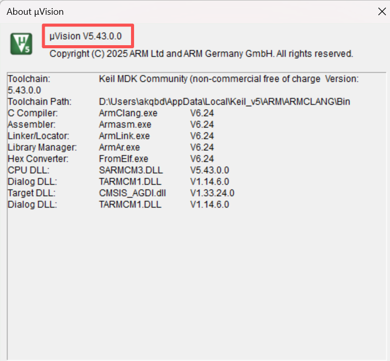

## 1.keil无法识别下载器

- **尝试卸载MicroLink CMSIS-DAP设备驱动，重新连接MicroLink；**

- **检查Keil版本，请给keil升级版本（不能低于5.29）。**

## 2.下载器功能与文档不符

请检查固件版本，升级到最新固件，升级方法请看这里：

https://microboot.readthedocs.io/zh-cn/latest/tools/microlink/microlink/#8