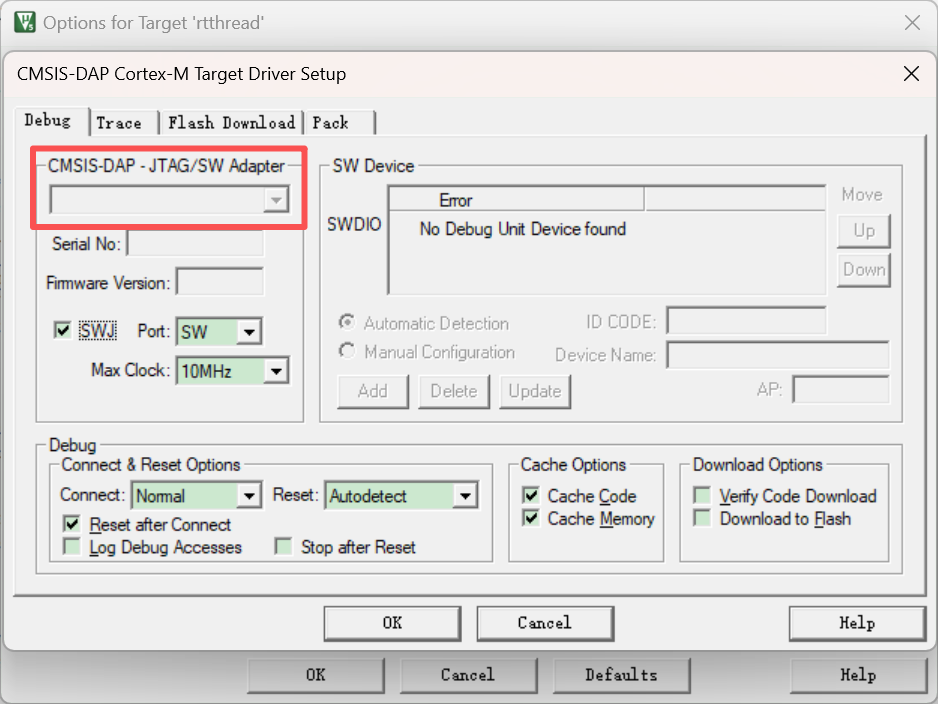
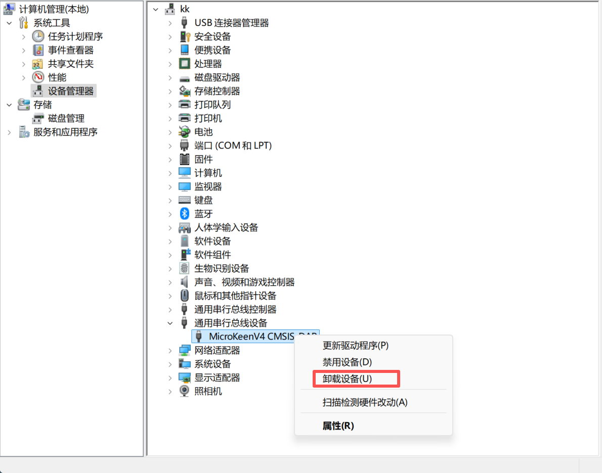

# 常见问题

## 设备连接

### Keil 无法识别下载器

1. 在设备管理器确认 CMSIS-DAP 设备正常；
2. 重新插拔 USB 数据线；
3. 更新 Keil，建议不低于 5.30；
4. 仍异常时卸载设备驱动并重新枚举。

## 烧录

### 工程里出现多个芯片型号

停止烧录，核对板上芯片丝印、当前 IDE Target、编译宏、Flash Algorithm 和链接布局。

## RTT 和符号

### RTT 自动搜索失败

确认固件初始化 RTT、ELF/MAP 匹配当前固件，并检查 `_SEGGER_RTT` 是否被堆栈覆盖。必要时从 MAP 获取地址。

### 变量不存在或值异常

确认变量没有被优化掉、ELF 包含 DWARF、地址在 SRAM，并确保 ELF 和固件来自同一次构建。

## SystemView

### 能找到 RTT，但没有 RTOS 事件

检查 SystemView 宏、RT-Thread hook list、通道 1和目标是否运行。普通 RTT 日志正常不代表 SystemView 已完成集成。

## 固件升级与资料

### 下载器固件和目标 MCU 固件有什么区别

下载器固件用于更新 MKLink 自身，V2 使用 `.rbl`，V3/V4 使用 `CHERRYUF2` 下的 `.uf2`。目标 MCU 固件是应用的 HEX/BIN，通过在线或脱机烧录写入芯片。两类文件不能混用，详见[固件升级](firmware-upgrade.md)。

### 从哪里下载软件、固件和 FLM

统一入口见[资料下载](downloads.md)。生产使用前记录下载来源、版本、文件大小和 SHA-256；升级包必须与下载器型号匹配，FLM 必须覆盖目标器件和固件地址范围。

## 功能与文档不一致

读取下载器固件版本和 Skill 版本。Skill 默认每 24 小时检查一次公开版本，GitHub 失败时使用 Gitee；固件仍需按对应型号的升级说明更新。
