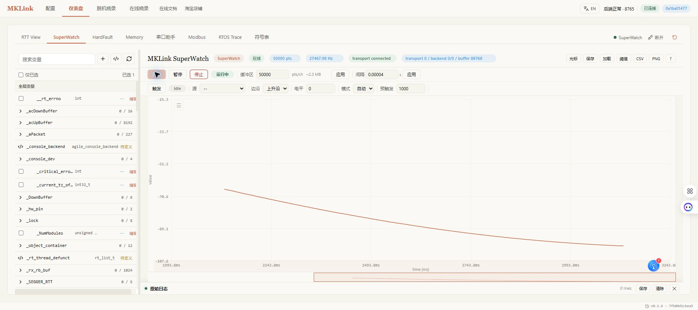
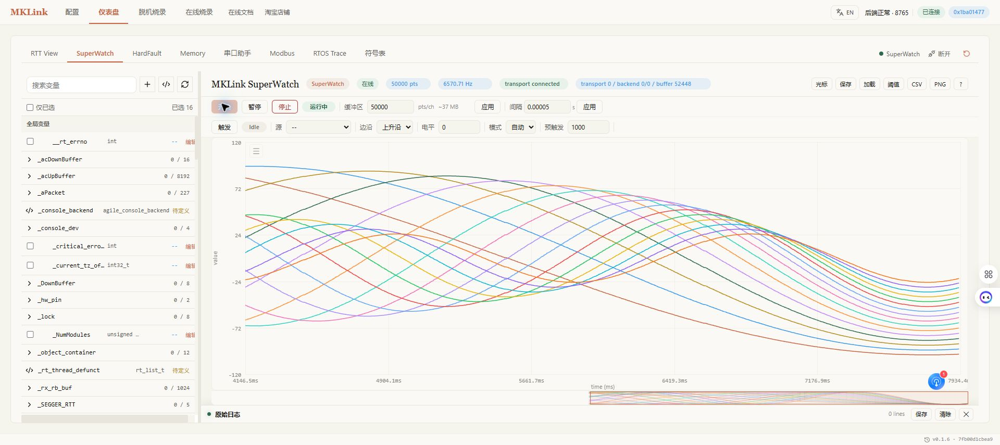

# SuperWatch 与 PID 调试

> 本页介绍 Web GUI 手动观测曲线。自动采样和参数比较见[嵌入式 AI 调试 PID](../../AI/pid-workflow.md)。

SuperWatch 根据 AXF/ELF 中的符号和类型，直接通过 SWD 连续读取 MCU 变量并绘制曲线。它不占用业务串口，也不要求在固件中增加专用数据帧，适合状态机、传感器、PID 和 FOC 控制环的运行观测。

## 什么时候使用

- 单次读取正常，但怀疑变量在时间轴上出现跳变；
- 需要比较给定值、反馈值、误差和控制输出；
- 串口已被产品协议占用；
- 希望把采样导出为 CSV，交给脚本或 AI 计算超调、稳态误差和响应时间。

如果已有稳定的串口协议并希望在外部工具中画图，可使用 [VOFA+](vofa.md)。需要看文本日志时使用 [RTT View](RTT_printf.md)。

## 准备工程和符号

1. 在“配置”页加载与芯片中固件来自同一次构建的 AXF/ELF；
2. 连接目标，在“符号”页确认目标变量能按正确类型读取；
3. 停止在线烧录、RTT Trace 等会占用目标调试资源的任务；
4. 从较慢的采样周期开始，确认稳定后再提高频率。

AXF 不匹配时，变量名可能存在但地址已经变化。这种情况下曲线看似有数据，也不能作为结论。

## STM32F103RET6 演示变量

案例固件在 MCU 上运行一个 10 ms PID 速度环和一阶对象模型。它不驱动真实电机，只用于复现控制环的阶跃响应。

| 变量 | 初值/范围 | 作用 |
|---|---:|---|
| `g_pid_target_rpm` | 800 / 1200 rpm | 每约 6 秒切换给定值 |
| `g_pid_feedback_rpm` | 实时变化 | 模拟转速反馈 |
| `g_pid_error_rpm` | 实时变化 | 给定值减反馈值 |
| `g_pid_output_permille` | 0–1000 | 限幅后的控制输出 |
| `g_pid_kp` | 0.60 | 比例系数 |
| `g_pid_ki` | 0.80 | 积分系数 |
| `g_pid_kd` | 0.005 | 微分系数 |
| `g_pid_simulated_load_percent` | 15% | 模拟负载 |
| `g_pid_fault_flags` | 0 为正常 | 参数保护标志 |

## 采集一组有效曲线

1. 在仪表盘打开 SuperWatch；
2. 搜索并加入 `g_pid_target_rpm`、`g_pid_feedback_rpm`、`g_pid_error_rpm` 和 `g_pid_output_permille`；
3. 将采样间隔设为 `0.01 s` 并应用；
4. 点击“开始”，至少运行 12 秒，覆盖一个完整的 800→1200→800 rpm 阶跃；
5. 检查点数持续增长、传输已连接、后端丢样为 0；
6. 暂停后缩放时间轴，需要复现时导出 CSV 和 PNG。

本次实测采样频率约 97 Hz，共 6400 点，后端丢样为 0。曲线清楚显示给定变化后，输出先改变，反馈随后跟随，误差逐渐收敛。只看到变量列表而没有曲线、点数或传输状态，不算完成采集。

## SuperWatch 性能实测

上一节的约 97 Hz 是 PID 案例主动设置 `10 ms` 周期后的业务采样率，不是 SuperWatch 的吞吐上限。为了测量连续地址变量的采集能力，另做了一组极限吞吐测试。

测试条件如下：

| 项目 | 条件 |
|---|---|
| 测试日期 | 2026-08-14 |
| 目标 | STM32F103RET6，72 MHz |
| 下载器 | MKLink V4，固件 V4.3.5 |
| Web GUI | MKLink AI Probe v0.1.6，保留 1 个真实浏览器订阅 |
| 调试链路 | SWD 10 MHz |
| 变量布局 | 1、4、8、16 个连续地址的 `float` 变量 |
| 采集方式 | `dump-memory` 一次读取完整连续区，再按变量类型拆分 |
| 测试方法 | 每种通道数预热 5 秒，连续运行约 60 秒，重复 3 轮 |
| 判定 | 同时检查目标读取、传输、后端、解析和浏览器链路的丢样计数 |

三轮平均结果如下。表中的“完整组率”表示每秒取得多少组完整的多通道快照；“变量点率”等于完整组率乘以通道数。

| 通道数 | 请求间隔 | 完整组率 | 变量点率 | 三轮丢样 |
|---:|---:|---:|---:|---:|
| 1 | 40 us | 27.4 k 组/s | 27.4 k 点/s | 0 |
| 4 | 30 us | 16.9 k 组/s | 67.6 k 点/s | 0 |
| 8 | 50 us | 11.2 k 组/s | 89.3 k 点/s | 0 |
| 16 | 50 us | 6.64 k 组/s | 106 k 点/s | 0 |

单通道测试使用 50,000 点缓冲区，页面实时报出约 27.5 kHz。连续运行时曲线保持连续，`transport 0 / backend 0/0`。

16 个变量连续存放时，SuperWatch 使用一次 `dump-memory` 读取整段内存，减少逐变量命令往返。页面实时报出约 6.57 k 组/s，即约 10.5 万个变量点每秒；16 路曲线连续，传输与后端丢样均为 0。

!!! important "正确理解性能数字"
    控制环观测应首先看“完整组率”，因为一组才代表同一采集周期内的全部变量。16 通道的 10.6 万点/s 不等于每个通道 10.6 万次/s，而是约 6.64 k 组/s × 16 通道。请求间隔只是上限目标；当链路达到饱和后，应以页面显示的实际采样率和丢样计数为准。

这组数据用于说明连续地址变量在指定测试条件下的能力，不是所有工程的保证值。目标芯片速度、SWD 时钟、接线质量、变量是否连续、主机性能以及同时运行的调试任务都会影响结果。变量分散在多个地址区间时需要多次读取，实际组率通常低于连续地址；PID、FOC 等工程应按控制带宽选择足够且稳定的采样率，不应盲目追求极限频率。

## HPM5301 FreeRTOS 实测

HPM5301 案例同样运行 10 ms PID 速度环。选择以下三个变量：

| 变量 | 含义 |
|---|---|
| `motor_target_rpm` | 800/1600 rpm 阶跃给定 |
| `motor_speed_rpm` | 一阶对象反馈 |
| `motor_command_percent` | 0–100% 控制输出 |

采样间隔设为 10 ms，窗口 2000 点，连续运行超过 20 秒。

本次实际约 84 Hz，传输和后端均未丢样。长窗口下曲线集中在右侧时，先暂停，再用滚轮放大阶跃局部。不要因为设置了 10 ms 就在报告中直接写“100 Hz”；应记录页面显示的实际采样率。

## 如何分析 PID

先固定采样周期、负载和给定阶跃，再比较参数变化：

| 指标 | 从曲线看什么 | 常见方向 |
|---|---|---|
| 上升时间 | 反馈从初值到接近给定值的时间 | 过慢时评估增大 `Kp` |
| 超调 | 反馈超过给定值的最大比例 | 过大时降低 `Kp/Ki` 或增加阻尼 |
| 稳态误差 | 稳定后给定与反馈的差 | 在不振荡的前提下调整 `Ki` |
| 输出饱和 | 输出停在 0 或 1000 的时间比例 | 检查限幅、负载和积分饱和 |
| 高频抖动 | 反馈、误差或输出的快速变化 | 检查采样噪声、`Kd` 和滤波 |

建议一次只改一个参数，每次不超过当前值的 10%–20%，每组参数至少运行两个完整阶跃并保存 CSV。积分必须限幅；出现故障标志、输出长时间饱和或反馈失控时立即停止。

## 用于 FOC 调试

FOC 不应只观察最终转速。按控制环从内到外建立变量组：

| 环节 | 建议变量 | 主要检查 |
|---|---|---|
| 电流环 | `Id_ref/Id_fb`、`Iq_ref/Iq_fb` | 跟踪误差、噪声、限幅 |
| 速度环 | `speed_ref/speed_fb/speed_err` | 超调、负载扰动、稳态误差 |
| 位置与角度 | 电角度、机械角度、观测器状态 | 连续性、跳变、丢同步 |
| 调制与保护 | `Vd/Vq`、母线电压、电流、保护标志 | 电压饱和和保护触发 |

先调电流内环，再调速度环，最后调位置环。不得关闭过流、过压、堵转、失速和温度保护来换取更平滑的曲线。

## 写变量的安全边界

写入参数会立即改变目标运行状态：

- 只写明确设计为在线调试参数的变量；
- 写前记录原值、类型、上下限和回滚值；
- 设置单次步长、最大试验时长和停止条件；
- 不写 RTOS 控制块、栈、堆、DMA 缓冲和未知结构体；
- 复位、烧录或切换 AXF 前先停止采样。

## 使用 AI 协助

> 采集 12 秒 PID 给定、反馈、误差和输出，计算超调与稳态误差；先不要写参数。

确认安全上下限后，才让 AI 提出小步长参数方案。真实电机和 FOC 场景必须保留人工急停和硬件保护。

HPM 案例可直接说：

> 采集 HPM5301 的目标、转速和输出 20 秒，报告实际采样率与丢样；先不要改 PID。

## 成功判据

- AXF/ELF 与已烧录固件匹配；
- 曲线覆盖完整业务周期；
- 采样频率、点数和丢样状态可见；
- 调参前后使用相同测试条件；
- CSV、参数记录和固件版本能够复现结论。
