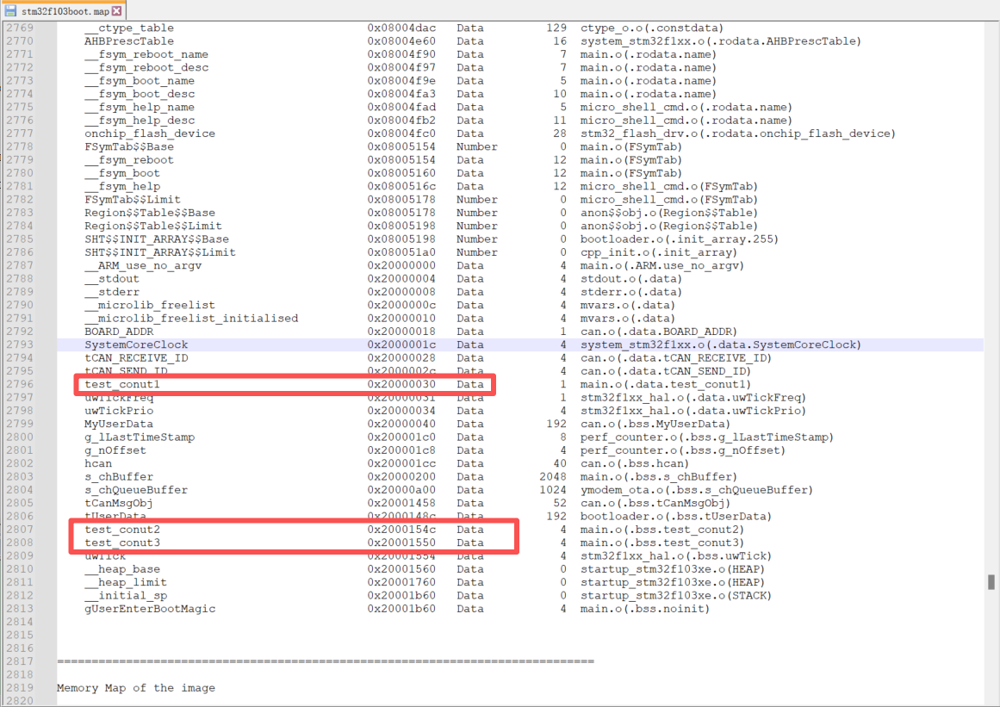

MicroKeen（MKLink）已完成对 **VOFA+ 上位机协议的原生适配**，可在功能与使用体验上**完美替代 J-Link 的 J-Scope**。无需额外的 USB 转串口模块或专用数据采集硬件，即可实现**高速、稳定、实时的数据可视化调试**。MKLink 通过 **SWD 直接读取目标芯片内存中的变量数据**，并将其实时封装为 VOFA+ 协议，经 USB CDC 虚拟串口发送至 PC，实现对运行中变量的**曲线显示、波形分析与参数调试**，且不占用 MCU 串口资源、不侵入业务代码。

#### 核心优势

- **无需占用 MCU 串口资源**
  不依赖 USART ，不影响产品原有通信接口设计；
- **基于 SWD 的非侵入式采集**
  不修改业务代码逻辑，对实时性影响极小；
- **高速刷新，稳定可靠**
  适配 MKLink 高速 SWD 通道，最高支持1M的读取速率；
- **即插即用**
  直接使用官方 VOFA+ 上位机，无需定制软件。

#### 使用方式

1. 使用 MKLink 连接目标板并正常下载程序；
2. 启动 VOFA+ 上位机，选择MKLink 提供的虚拟串口，发送启动命令。
3. 最多一次支持读取16个float类型的变量

```python
vofa.send(0x20000030,1,0.00001)
```

- 0x20000030:变量1内存地址；
- 1：读取一个数据，只支持float类型；
- 0.00001：读取周期，单位秒，最小支持1us

相关的变量地址可以通过查看MDK编译生成的.map文件来查找，如下：



📌 示例画面：


