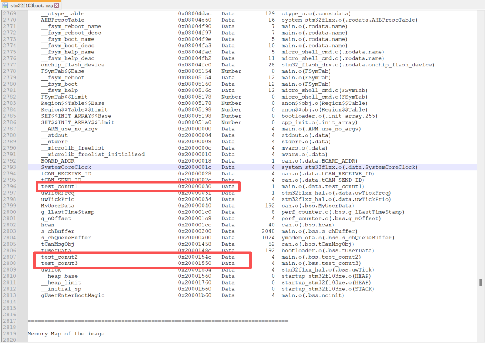
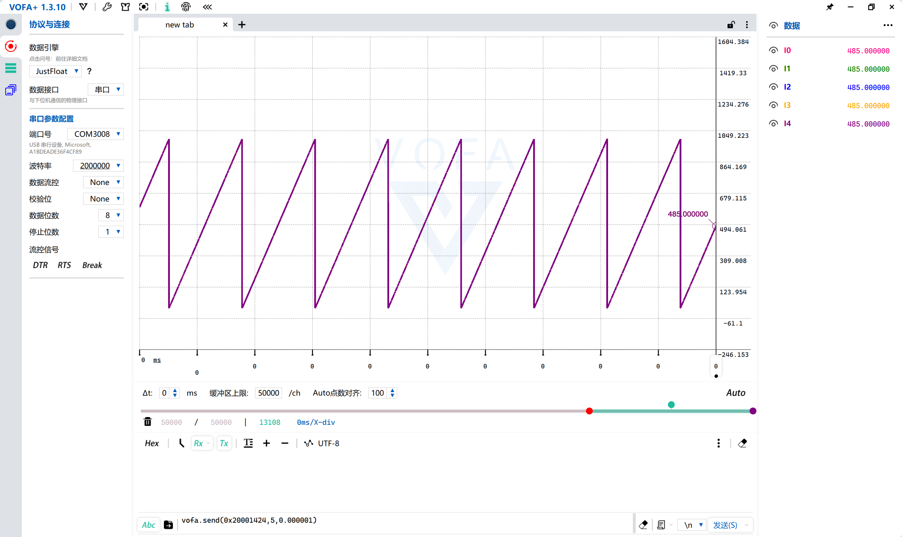

# VOFA+ 第三方上位机

VOFA+ 是独立的第三方数据可视化上位机。MKLink 的作用是通过 SWD 直接读取目标 RAM 变量，将数据封装成 VOFA+ 支持的 JustFloat 数据流，再从下载器 USB CDC 虚拟串口送到 VOFA+。整个过程不占用目标 MCU 的业务 UART，也不需要在业务代码中周期发送数据帧。

```text
目标 RAM 变量 -> MKLink 通过 SWD 采样 -> JustFloat -> USB CDC -> VOFA+
```

需要按 ELF 符号名浏览、在线写参或在 Web 中快速画曲线时，使用 [SuperWatch](superwatch.md)。已经习惯 VOFA+ 的触发、游标、通道和数据引擎时，使用本页流程。

## 1. 确认变量地址和类型

从当前构建的 MAP 或 ELF 中找到变量地址。重新编译后地址可能变化，因此地址必须与目标中正在运行的固件属于同一次构建。



记录每个变量的：

| 项目 | 示例 |
|---|---|
| 变量名 | `motor_speed_rpm` |
| 地址 | `0x00084890` |
| C 类型 | `float` |
| 单位 | rpm |

MKLink 支持 `int8_t`、`uint8_t`、`int16_t`、`uint16_t`、`int32_t`、`uint32_t`、`float` 和 `bool` 等常用类型。非 4 字节变量应按固件要求进行 4 字节对齐，避免 SWD 读取时出现撕裂。

## 2. 在 VOFA+ 中连接 MKLink

1. 启动第三方 VOFA+；
2. 数据引擎选择 `JustFloat`；
3. 数据接口选择“串口”；
4. 端口选择 MKLink 对应的 USB CDC 虚拟串口；
5. 波特率选择 `2000000`，数据位 8、停止位 1、无校验、无流控；
6. 打开串口后，从 VOFA+ 底部发送框下发 `vofa.send(...)`。

波特率是 PC 串口配置项；目标变量本身仍由 MKLink 通过 SWD 读取，不占用 MCU UART。

## 3. 发送采样命令

### 连续 float

从起始地址读取连续的 float：

```text
vofa.send(0x20001424,5,0.000001)
```

参数依次是起始地址、通道数和采样周期。

### 多地址、多类型

变量不连续或类型不同时，逐项给出地址和类型，最后一个参数是采样周期：

```text
vofa.send(0x20000030,"uint8_t",0x2000154c,"float",0x20001550,"float",0.00001)
```

一次最多观察 16 个变量。先从 10 ms 或更慢周期开始，再根据实际带宽调整；不要把设置周期直接当作实际采样率。



图中 VOFA+ 已选择 JustFloat 和 MKLink 虚拟串口，底部命令由 VOFA+ 直接发给下载器。右侧通道和中间曲线来自 MKLink 的 SWD 变量采样。

## 4. HPM5301 PID 示例

HPM5301 FreeRTOS 实战中的三个变量地址为：

| 通道 | 地址 | 类型 |
|---|---:|---|
| 目标转速 `motor_target_rpm` | `0x000848EC` | `float` |
| 实际转速 `motor_speed_rpm` | `0x00084890` | `float` |
| 输出 `motor_command_percent` | `0x00084894` | `float` |

在 VOFA+ 中发送：

```text
vofa.send(0x000848EC,"float",0x00084890,"float",0x00084894,"float",0.01)
```

让目标运行至少 15 秒，覆盖 800→1600→800 rpm 的完整阶跃。应看到目标先跳变，输出立即响应，实际转速随后收敛。重新编译本工程后，先从新 ELF/MAP 重新取地址，不能继续使用表中的旧值。


图中 I0 为目标转速，I1 为实际转速，I2 为控制输出。左侧保留了 `JustFloat`、`COM220` 和 `2000000` 配置，底部可见实际 `vofa.send` 命令。目标与反馈覆盖多次 800/1600 rpm 阶跃；由于输出为 0–100%，与转速共用纵轴时曲线靠近底部属于正常现象。

## 5. 停止采集

在 VOFA+ 发送以下命令停止变量流：

```text
RTTView.stop()
```

部分固件也支持：

```text
vofa.send(0x20000000,"uint8_t",0)
```

停止后关闭 VOFA+ 串口，确认 MKLink 资源已释放，再切换到在线烧录、RTT、SuperWatch 或 RTOS Trace。同一虚拟串口不能被多个程序同时打开。

## 6. 如何判断数据可信

- 变量地址和类型来自当前 ELF/MAP；
- VOFA+ 通道数与 `vofa.send` 参数一致；
- 静态值能与符号读取或 Memory 交叉验证；
- 曲线与目标输入、RTT 时间戳或业务动作一致；
- 高速采样时没有持续断帧、异常尖峰或串口占用错误；
- 停止后探针能被其他功能正常连接。

常见异常：

| 现象 | 排查 |
|---|---|
| VOFA+ 没有曲线 | 检查 JustFloat、COM 号、串口是否打开、命令是否带换行 |
| 数值完全错误 | 检查地址、类型、大小端和 ELF 是否匹配 |
| 只有第一帧 | 检查采样周期参数和下载器固件版本 |
| 曲线频繁断裂 | 降低通道数或采样率，检查 USB 和其他探针任务 |
| 端口被占用 | 停止 Web Viewer/CLI/RTT，并关闭其他串口工具 |

## 使用 AI

> 从当前 ELF 找出这三个变量的地址和类型，给出 VOFA+ `vofa.send` 命令；不要写变量。

完整 HPM 操作见 [HPM5301 + FreeRTOS 全功能实战](hpm5301-freertos-case.md)。
