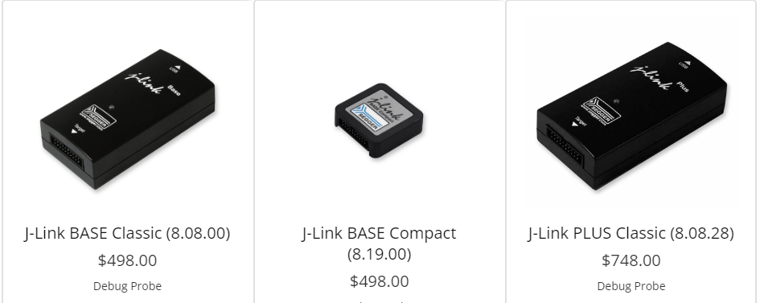
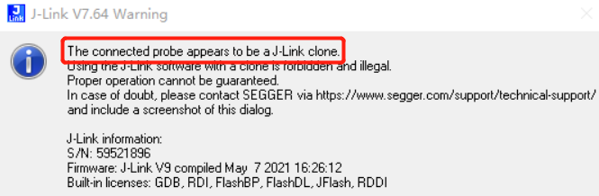
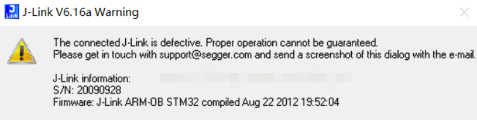
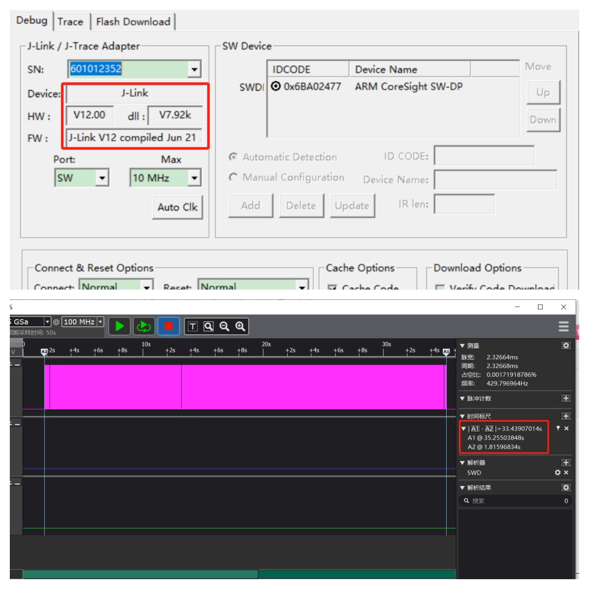
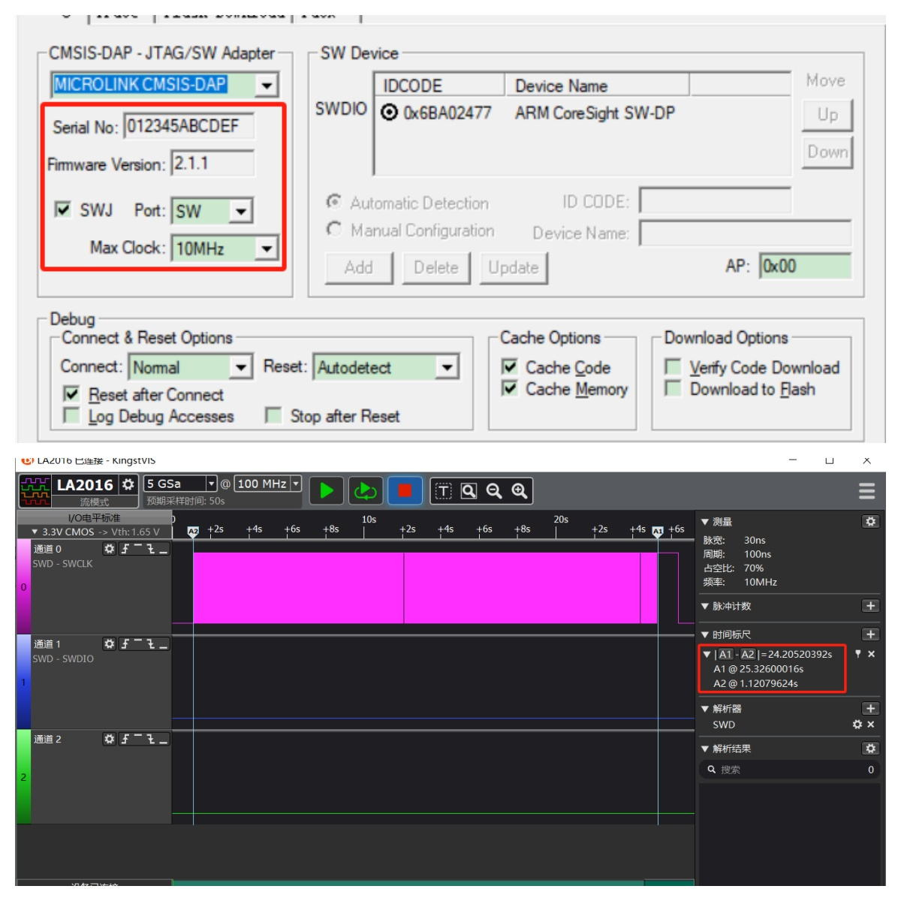
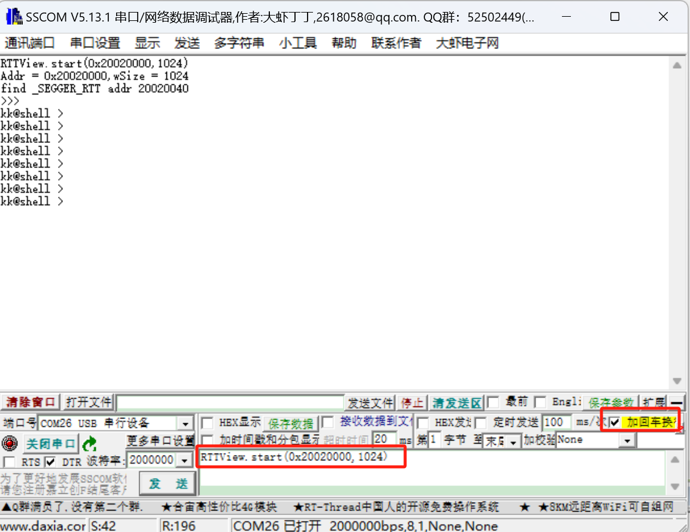

# 一个调试器，干掉四套工具链

# 我把调试、下载、量产、IAP升级 全都塞进了一个小盒子里

## 先看一个真实的产品生命周期

### 第一阶段：研发 —— Debug 才是核心战场

很多人以为下载速度是重点。

错。

下载速度快只是最基本的需求。

真正需要解决的是：

- printf 打日志
- 实时数据可视化
- rtos的任务时序分析

于是你会用到：

- J-Link 下载调试
- USB 转串口看日志
- J-Scope数据可视化
- SEGGER SystemView 分析任务时序

### 第二阶段：小批量 / 量产 —— 又换一套

终于调通。

进入试产。

问题来了：

你总不能让产线工人用调试器烧录吧？

于是又要买：

- 脱机下载器
- 固定烧录流程
- 重新培训产线

研发阶段的工具，不能直接用于生产。

这本来是一个“同类功能”。

却被割裂成两套体系。

### 第三阶段：售后 —— 真正的拦路虎

产品发出去以后。

Bug 会出现。

甲方会提新需求。

必须升级固件。

这时候你要做什么？

- 写 IAP Bootloader
- 再开发 PC 升级上位机
- 再维护一套通信协议

于是——

又一套工具体系诞生了。

### 问题的本质

研发一套工具。
量产一套工具。
售后一套工具。

同一个产品，三套工具。

## 一、我们真的需要这么多工具吗

### 1、正版调试器确实强，但不是谁都负担的起

说到调试器，绕不开 SEGGER 的 J-Link。

性能强，生态成熟。

但现实是：

- 项目一多，成本直线上升
- 团队多人开发，每人一台？
- 产线要不要配？
- 售后要不要备？

工具成本，很快就从“合理”，变成“压力”。



### 2、用盗版？风险提示你忍得了吗？

**你一定见过这些提示：**

**盗版检测：**the connected probe appears to be a j-link clone



**连接故障：**The connected J-Link is defective



**质量堪忧：**市面上常见的盗版jlink，质量一言难尽，当调试器本身不稳定时，你的研发效率就已经被拖垮了。

### 3、真正的问题：工具链是割裂的

典型开发流程：

| 阶段     | 工具                      |
| -------- | ------------------------- |
| 调试下载 | J-Link                    |
| 串口日志 | USB 转串口                |
| 量产烧录 | 脱机下载器                |
| 售后升级 | 自研bootloader+升级上位机 |

每个阶段都在换工具。

每换一次：

- 学习成本
- 维护成本
- 培训成本
- 适配成本

真正消耗的不是钱。

是精力。

## 二、我想做一件更简单的事

我问自己一个问题：

> 能不能用一套硬件，覆盖整个产品生命周期？

于是有了 **MicroKeen（MKLink）**。

### 1、功能覆盖

| 功能/型号                                       | MKLink V2 | MKLink  V3 | MKLink V4 |
| ----------------------------------------------- | --------- | ---------- | --------- |
| 高速在线下载调试                                | ✔         | ✔          | ✔         |
| 高速USB转串口(12M)                              | ✔         | ✔          | ✔         |
| USB转RTTVIEW                                    | ✔         | ✔          | ✔         |
| USB转SystemView                                 | ✔         | ✔          | ✔         |
| USB转VOFA+                                      | ✔         | ✔          | ✔         |
| 支持python脚本                                  | ✔         | ✔          | ✔         |
| 支持winusb，win10以上系统免驱                   | ✔         | ✔          | ✔         |
| 自动扫描芯片，提示连接成功                      |           | ✔          | ✔         |
| vref电压自适应，1.8~5V电压                      |           | ✔          | ✔         |
| 拖拽下载(bin文件)                               | ✔         |            |           |
| 脱机下载(bin文件，hex文件)，支持解析FLM下载算法 | ✔         | ✔          | ✔         |
| 内置512kB 内部flash                             | ✔         |            |           |
| 内置4MB nor flash                               |           | ✔          |           |
| 内置128MB SD卡                                  |           |            | ✔         |
| USB转485                                        |           |            | ✔         |
| 功率计：电压电流实时显示                        |           |            | ✔         |
| 内置ymodem等自定义协议串口升级固件              |           |            | ✔         |

### 2、MicroKeen（MKLink） vs J-Link

| 能力维度                          | **MicroKeen（MKLink）**                                | **J-Link**                      | 差异化说明                    |
| --------------------------------- | ------------------------------------------------------ | ------------------------------- | ----------------------------- |
| **在线下载与调试**                | CMSIS-DAP V2                                           | 专有协议                        | 各有千秋                      |
| **USB 转串口**                    | 内置高速 USB-UART最高 12M Baud                         | 需外接或特定型号支持            | MKLink 原生集成，减少工具依赖 |
| **RTT / RTTView**                 | 原生支持 RTT<br/>任意串口助手上位机可用                | 需 RTTViewer 专用上位机         | MKLink 更开放，不绑定上位机   |
| **SystemView**                    | 原生 SystemView 协议<br/>RTT 方式采集<br/>无需额外硬件 | 依赖 J-Link 硬件                | 功能等效，硬件与成本更友好    |
| **数据可视化（VOFA+ / J-Scope）** | 原生 VOFA+ 协议<br/>基于 SWD 非侵入采集                | J-Scope 专有协议                | VOFA+数据可视化效果更佳       |
| **自动化与脚本能力**              | 内置 Python 脚本引擎<br/>可定制量产 / 升级流程         | J-Link Commander<br/>命令式控制 | MKLink 更适合复杂自动化场景   |
| **量产与脱机下载**                | 支持脱机烧录<br/>FLM + Python 脚本                     | 需额外量产工具                  | MKLink 覆盖生产阶段           |
| **IAP升级能力**                   | 内置ymodem协议栈                                       | 无                              | 原生支持ymodem协议升级固件    |

### 购买地址

MKLinkV2        淘宝链接：https://item.taobao.com/item.htm?ft=t&id=895964393739

MKLinkV3        淘宝链接：https://item.taobao.com/item.htm?ft=t&id=1013104417098

MKLinkV4        淘宝链接：https://item.taobao.com/item.htm?ft=t&id=1020501356342

## 三、MicroKeen的底层逻辑

它不是一个“下载器”，是开发平台。

### 1、性能基础：不是随便选的 MCU

采用 先楫半导体 HPM 高性能 MCU：

- 360 MHz 主频
- 内置 USB High-Speed PHY

这不是为了“堆配置”。

而是为了并行运行多种调试任务。

### 2、软件架构：不是堆功能，而是做平台

- RT-Thread RTOS

提供稳定的多任务调度与资源管理，支撑调试、下载、数据转发并行运行；

- CherryUSB 协议线

基于 USB HS，实现 CDC / MSC  多类设备高速并行工作；

- PikaPython 脚本引擎

在设备侧运行 Python解释器，支持脱机下载与升级流程的脚本化与二次开发；

- Arm-2D 图形加速库

UI加速引擎，实现流畅、低资源占用的本地人机交互界面。

### 3、关键创新点：一根 USB 线，全搞定

一个 USB 口，同时支持：

- CMSIS-DAP 调试
- USB 转串口（最高 12M Baud）
- RTT 转发
- SystemView 协议
- VOFA+ 协议
- 脱机下载
- IAP升级
- WinUSB 免驱

你不再需要：

- RTTViewer
- J-Scope
- 额外串口工具
- 开发升级上位机

真正实现：

**Debug 全家桶，一体化。**

## 四、它到底能干什么？

### 1、下载速度，真的快

与目前市面上最新的J-LINK-V12速度对比，目标芯片使用STM32H743，开发环境MDK V5.39，分别使用**MicroLink**和**Jlink V12**将**2558KB**的HEX文件下载到内部FLASH中。使用逻辑分析仪测试时钟引脚，计算出擦除，编程，校验全过程的时间，MicroLink使用时间为**24.205秒**，Jlink V12使用时间为**33.439秒**，测试数据如下图：

**Jlink V12测试结果：**



**MicroLink测试结果：**



**测试结果对比：**

| 调试器        | 总耗时（擦除，编程，校验） |
| ------------- | :------------------------: |
| **MicroLink** |        **24.205秒**        |
| J-LINK V12    |          33.439秒          |

### 2、高速USB转串口

MicroLink内置USB转串口功能，支持常见的串口和485通信，串口最大支持12M波特率，无丢包。


使用逻辑分析仪抓取波形如图所示，每个bit传输的时间为1/10M=100ns。


### 3、RTT，不再绑定专用上位机

MicroKeen（MKLink）实现了对 SEGGER Real Time Transfer（RTT）的原生支持，在不中断目标系统运行的前提下，实现高速、双向的实时数据交互与调试通信，是传统串口调试方式的高效替代方案。

**实现原理：**


只要拥有了MKLink，你就可以享受以下的便利：

- 无需占用UART，将printf重定位到RTT；

- 不需要使用专门的RTTView上位机，支持任意串口助手；

- 高速通信，不影响芯片的实时响应。

比如使用SSCOM，连接MicroLink的虚拟串口，输入以下指令：

```
RTTView.start(0x20000000,1024,0)
```

- 0x20000000:搜索RTT控制块的起始地址；
- 1024：搜寻范围大小；
- 0：启动RTT的通道。



###  4、VOFA+ 可视化，不占 MCU 串口

MicroKeen（MKLink）已完成对 VOFA+ 上位机协议的原生适配，可在功能与使用体验上完美替代 J-Link 的 J-Scope。

**实现原理：**

MKLink 通过 SWD 直接读取目标芯片内存中的变量数据，并实时封装为 VOFA+ 协议，经 USB CDC 虚拟串口发送至 PC，实现对运行中变量的曲线显示、波形分析与参数调试，且不占用 MCU 串口资源、不侵入业务代码。

**核心优势：**

- 无需占用 MCU 串口资源

- 基于 SWD 的非侵入式采集

- 支持多种数据类型

- 高速刷新，稳定可靠

打开VOFA+上位机，并连接虚拟串口，发送

```python
vofa.send(0x20000030,"uint8_t",0x2000154c,"float",0x20001550,"float",0.00001)
```

- 0x20000030:变量1内存地址；
- uint8_t：变量1数据类型；
- 0.00001：读取周期，单位秒，最小支持1us


### 5、原汁原味的SystemView

 MicroKeen（MKLink）已完成对 SEGGER SystemView 协议的原生支持，无需额外分析硬件，即可实现对 RTOS 运行状态的任务级可视化分析，显著降低系统级调试门槛。

**实现原理：**


**核心优势：**

- 无需额外 Trace 硬件

- 基于 RTT 的低侵入式采集

- 支持主流 RTOS（RT-Thread / FreeRTOS）

- 任务级、时间轴级运行态分析

- 即插即用，兼容官方 SystemView 工具


### 6、量产？直接脚本化

MicroLink支持脱机离线下载的功能，借助于强大的PikaPython开源项目，让MicroLink可以使用python脚本进行二次开发，可以非常容易得定制升级流程。

MicroLink的虚拟U盘中有一个`offline_download.py`文件，内容如下：

```python
import PikaStdLib
import time
import cmd
import load
# SWD 时钟频率（Hz）
SWD_CLOCK_HZ = 10000000
 # 设置下载速度
cmd.set_swd_clock(SWD_CLOCK_HZ)
abort = False
# 加载下载算法 
if load.flm("FLM/STM32F10x_1024.FLM", 0x08000000, 0x20000000) != 0:
    print("load flm failed")
    abort = True
    break
# 下载bin文件     
if load.bin("bootloader.bin",0x08000000) != 0:
    print("load bin failed")
    abort = True
    break        
# 下载hex文件     
if load.hex("rt-thread.hex") != 0:
    print("load hex failed")
    abort = True
    break

if not abort:
    cmd.set_beep_on()
    time.sleep_ms(100)
    cmd.set_beep_off()
else:
    print("auto download aborted")

```

该代码通过加载FLM算法文件，将多个二进制文件（如bootloader.bin和rt-thread.hex）分别烧录到STM32内部不同地址的flash中。

> **注意：**请根据您的实际项目需求，修改以下内容：
>
> - **下载算法文件名称**（如 `"FLM/STM32F10x_1024.FLM"`）：应替换为对应芯片和Flash型号的 FLM 文件。
> - **下载文件名称及地址**（如 `"bootloader.bin"`、`"rt-thread.hex"`，及其对应的地址）：请确保文件名和烧录地址与您的程序结构一致。

### 7、售后升级？MicoBoot搭配MicroKeen为君解忧

MKLink内置Ymodem协议，支持通过串口进行可靠的文件传输。ymodem协议在多次重传时仍能保持数据的完整性，非常适用于嵌入式系统的固件升级。

使用内置的ymodem协议发送文件，首先需要目标设备支持ymodem协议接收文件，MicorBoot开源框架集成了ymodem模块，可以方便用户直接安装使用，具体使用方法请看MicorBoot简介。

MicroBoot简介：https://microboot.readthedocs.io/zh-cn/latest/

借助python脚本，只需要在脚本中编写几行代码，便可以让MKLINK摇身一变为ymodem文件传输工具，给单片机设备做IAP升级。

```python
import PikaStdLib
import cmd
import ym
ymodem = ym.ymodem("uart",115200)
#ymodem = ym.ymodem("485",115200)
ymodem.send("rt-thread.hex")
```

无需额外开发 PC 升级软件。

## 五、开源向实

开源向实：不止是一个工具，也是一个开发平台

基于 MKLink 硬件平台，后续将持续开放并完善完整示例工程，   

涵盖：

- RT-Thread：在先辑硬件平台上的工程化实践

- CherryUSB：USB HS 多类设备的真实应用范例

- PikaPython：嵌入式 Python 在工具与流程中的落地使用

- Arm-2D：高性能UI加速引擎，实现流畅图形与人机交互

- 开发者不仅可以“使用” MKLink，还可以将 下载器本身作为开发板，学习、验证并实践这些优秀开源项目在真实产品中的协同使用方式。

**开源不止于代码，价值在于落地**

**MKLink，**希望成为连接开源生态与工程实战的那座桥梁。

**MKLink简介**：https://microboot.readthedocs.io/zh-cn/latest/tools/microlink/microlink/

### 六、真正的意义

我后来发现：

MicroLink 的价值，不在“它比谁快”。

而在于：

> 它把工具链统一了。

 研发用它
 调试用它
 量产用它
 售后也用它

我做 MicroKeen，不是为了替代谁。

而是想解决一个问题：

> 为什么一个产品生命周期，需要这么多工具链？

如果你也受够了频繁切换工具。

也许它，会是你想要的答案。

