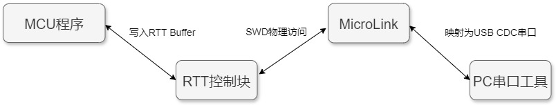
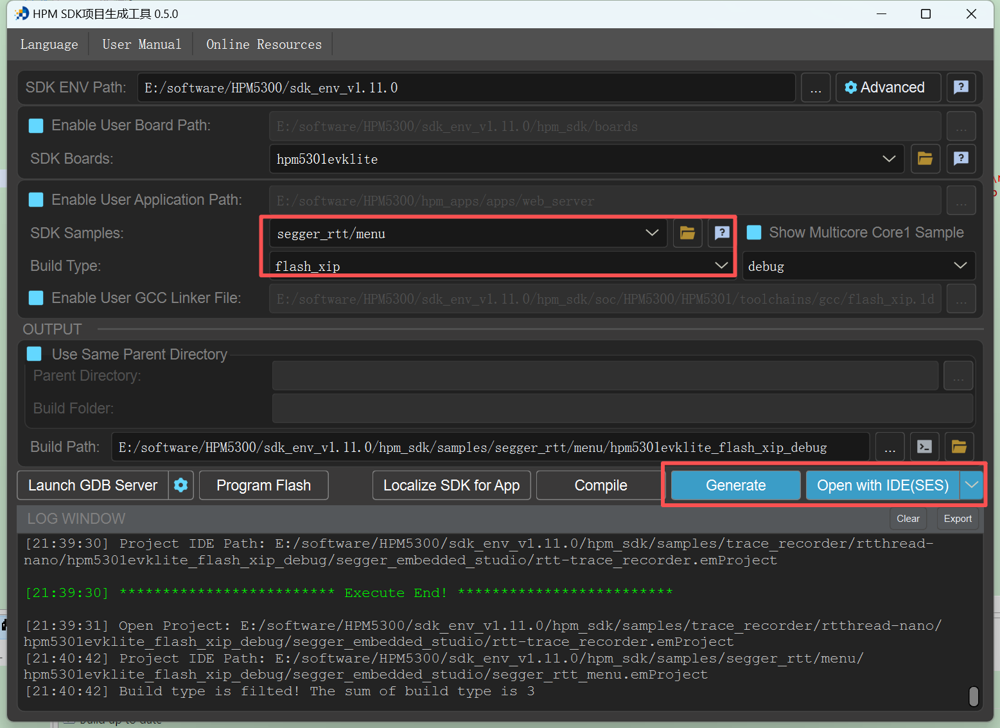
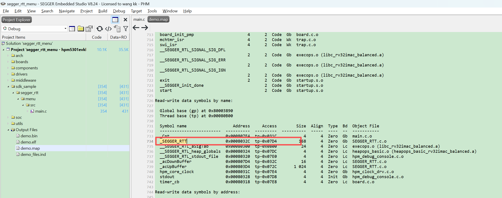
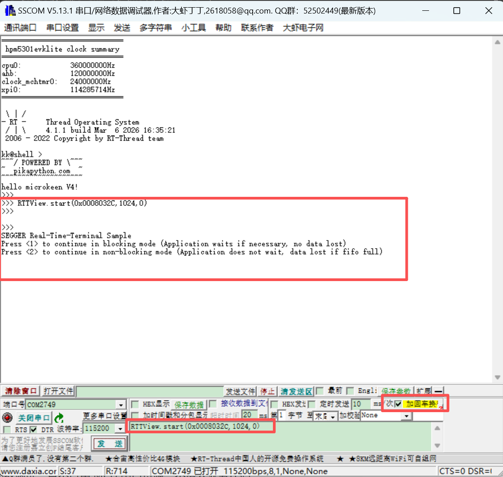
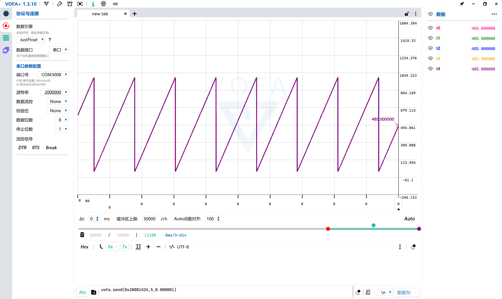
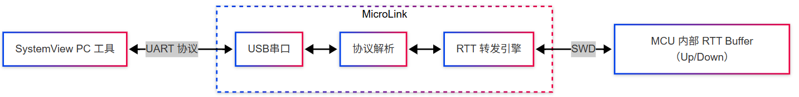
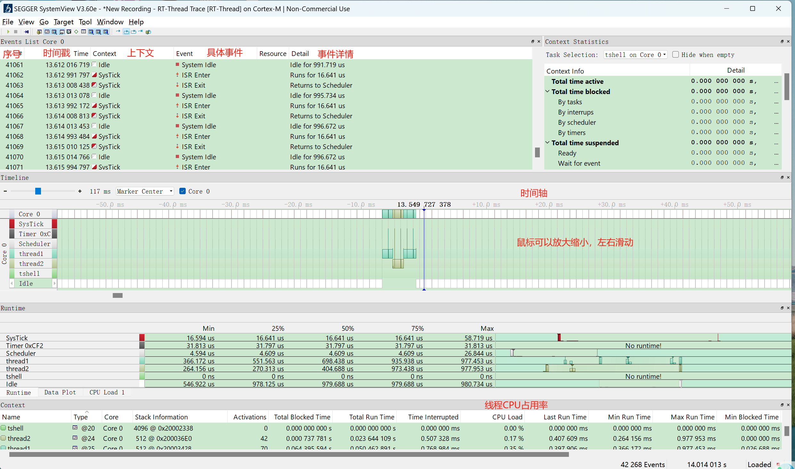
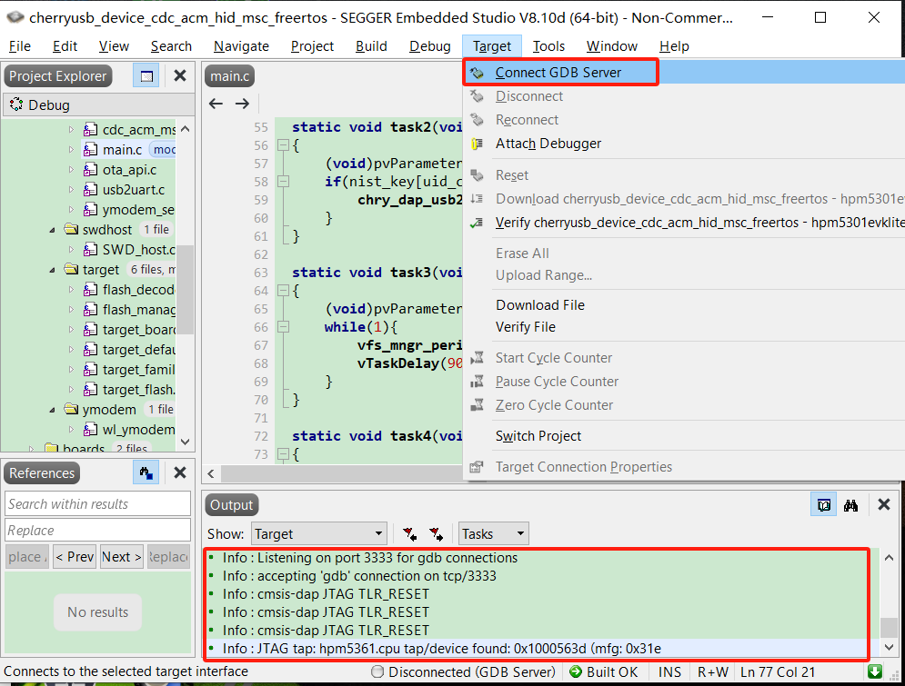
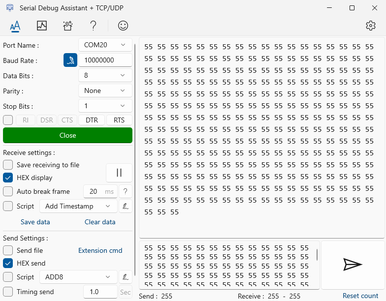
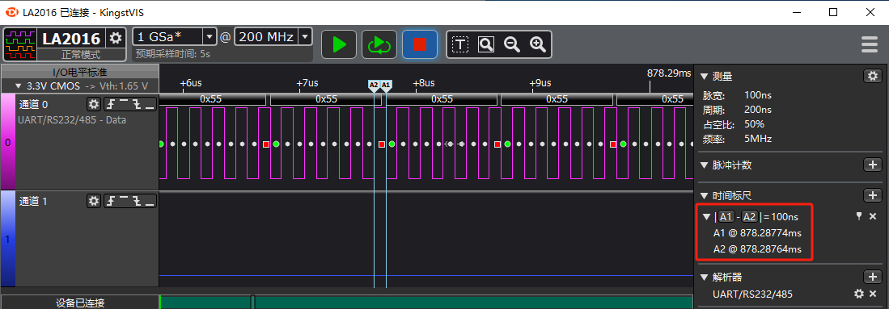

# MKLink多功能下载器全面支持先楫生态

## 一、嵌入式开发大杀器

做嵌入式开发，你一定经历过这种场景：

桌面上插满了设备——

 **调试器、串口工具、脱机下载器、升级工具、……**

研发一套工具，量产又换一套；

售后升级，还得再做一套上位机。

**工具越来越多，效率却越来越低。**

于是，**MicroKeen（简称 MKLink）**诞生了。

它把开发者在 **研发、调试、量产、售后** 各阶段需要的工具全部整合进一个设备：

- 调试器
- USB 转串口
- SEGGER RTT， J-Scope、SystemView数据转发 
- 脱机下载器
- IAP 升级工具

**一台设备，覆盖产品整个生命周期。**

不再频繁切换工具，不再维护一堆软件环境。

 **一套设备，解决所有问题。**

### 1、功能覆盖

| 功能/型号                                       | MKLink V2 | MKLink  V3 | MKLink V4 |
| ----------------------------------------------- | --------- | ---------- | --------- |
| 高速在线下载调试                                | ✔         | ✔          | ✔         |
| 高速USB转串口(12M)                              | ✔         | ✔          | ✔         |
| USB转RTTVIEW                                    | ✔         | ✔          | ✔         |
| USB转SystemView                                 | ✔         | ✔          | ✔         |
| USB转VOFA+                                      | ✔         | ✔          | ✔         |
| 支持python脚本                                  | ✔         | ✔          | ✔         |
| 支持winusb，win10以上系统免驱                   | ✔         | ✔          | ✔         |
| 自动扫描芯片，提示连接成功                      |           | ✔          | ✔         |
| vref电压自适应，1.8~5V电压                      |           | ✔          | ✔         |
| 拖拽下载(bin文件)                               | ✔         |            |           |
| 脱机下载(bin文件，hex文件)，支持解析FLM下载算法 | ✔         | ✔          | ✔         |
| 内置512kB 内部flash                             | ✔         |            |           |
| 内置4MB nor flash                               |           | ✔          |           |
| 内置128MB SD卡                                  |           |            | ✔         |
| USB转485                                        |           |            | ✔         |
| 功率计：电压电流实时显示                        |           |            | ✔         |
| 内置ymodem等自定义协议串口升级固件              |           |            | ✔         |

### 2、MicroKeen（MKLink） vs J-Link

| 能力维度                          | **MicroKeen（MKLink）**                                | **J-Link**                      | 差异化说明                    |
| --------------------------------- | ------------------------------------------------------ | ------------------------------- | ----------------------------- |
| **在线下载与调试**                | CMSIS-DAP V2                                           | 专有协议                        | 各有千秋                      |
| **USB 转串口**                    | 内置高速 USB-UART最高 12M Baud                         | 需外接或特定型号支持            | MKLink 原生集成，减少工具依赖 |
| **RTT / RTTView**                 | 原生支持 RTT<br/>任意串口助手上位机可用                | 需 RTTViewer 专用上位机         | MKLink 更开放，不绑定上位机   |
| **SystemView**                    | 原生 SystemView 协议<br/>RTT 方式采集<br/>无需额外硬件 | 依赖 J-Link 硬件                | 功能等效，硬件与成本更友好    |
| **数据可视化（VOFA+ / J-Scope）** | 原生 VOFA+ 协议<br/>基于 SWD 非侵入采集                | J-Scope 专有协议                | VOFA+数据可视化效果更佳       |
| **自动化与脚本能力**              | 内置 Python 脚本引擎<br/>可定制量产 / 升级流程         | J-Link Commander<br/>命令式控制 | MKLink 更适合复杂自动化场景   |
| **量产与脱机下载**                | 支持脱机烧录<br/>FLM + Python 脚本                     | 需额外量产工具                  | MKLink 覆盖生产阶段           |
| **IAP升级能力**                   | 内置ymodem协议栈                                       | 无                              | 原生支持ymodem协议升级固件    |

## 二、MicroKeen的底层逻辑

### 1、性能基础：不是随便选的 MCU

采用 先楫半导体 HPM5301高性能 MCU：

- 360 MHz 主频
- 内置 USB High-Speed PHY

这不是为了“堆配置”。

而是为了并行运行多种调试任务。

### 2、软件架构：不是堆功能，而是做平台

- RT-Thread RTOS

提供稳定的多任务调度与资源管理，支撑调试、下载、数据转发并行运行；

- CherryUSB 协议线

基于 USB HS，实现 CDC / MSC  多类设备高速并行工作；

- PikaPython 脚本引擎

在设备侧运行 Python解释器，支持脱机下载与升级流程的脚本化与二次开发；

- Arm-2D 图形加速库

UI加速引擎，实现流畅、低资源占用的本地人机交互界面。

### 3、关键创新点：一根 USB 线，全搞定

一个 USB 口，同时支持：

- CMSIS-DAP 调试
- USB 转串口（最高 12M Baud）
- RTT 转发
- SystemView 协议
- VOFA+ 协议
- 脱机下载
- IAP升级
- WinUSB 免驱

你不再需要：

- RTTViewer
- J-Scope
- 额外串口工具
- 开发升级上位机

真正实现：

**Debug 全家桶，一体化。**

## 三、它到底能干什么？

### 1、脱机下载不仅支持arm内核，还支持HPM单片机的RISC-V内核

MicroLink支持脱机离线下载的功能，借助于强大的PikaPython开源项目，让MicroLink可以使用python脚本进行二次开发，可以非常容易得定制升级流程。

MKLink支持用户自定义编写python脚本来定义下载流程，比如默认提供的脱机下载配置文件`offline_download.py`，内容如下：

```python
import PikaStdLib
import hpm
################board name#################
#  hpm5e00evk,0xfcf90002U,0x00000005U,0x00001000U
#  hpm6e00evk,0xfcf90001U,0x00000005U,0x00001000U
#  hpm6p00evk,0xfcf90002U,0x00000005U,0x00001000U
#  hpm5300evk,0xfcf90002U,0x00000005U,0x00001000U
#  hpm5301evklite,0xfcf90002U,0x00000005U,0x00001000U
#  hpm6200evk,0xfcf90001U,0x00000005U,0x00001000U
#  hpm6300evk,0xfcf90001U,0x00000005U,0x00001000U
#  hpm6750evk2,0xfcf90002U,0x00000005U,0x0000000EU
#  hpm6750evkmini,0xfcf90002U,0x00000005U,0x0000000EU
#  hpm6800evk,0xfcf90001U,0x00000005U,0x00001000U
###########################################

hpm.board("hpm5300evk")
#hpm.flash_cfg(0xfcf90002U,0x00000005U,0x00001000U)
hpm.program("demo.bin",0x80000400)

```

默认支持HPM全系列的单片机配置，调用`hpm.program("demo.bin",0x80000400)`，将demo.bin下载到0x80000400地址中。

> **注意：**请根据您的HPM具体型号，修改以下内容：
>
> - **对应的开发板board名称**（如 `"hpm5300evk"`）：`hpm.board("hpm5300evk")`应替换为对应芯片的名称；或者使用hpm.flash_cfg()直接配置芯片的参数，两种方式二选一。
> - **下载文件名称及地址**（如 `"demo.bin"`，及其对应的地址）：请确保文件名和烧录地址与您的程序结构一致，同时支持烧录多个文件。


### 2、售后升级？MicoBoot搭配MicroKeen为君解忧

MKLink内置Ymodem协议，支持通过串口进行可靠的文件传输。ymodem协议在多次重传时仍能保持数据的完整性，非常适用于嵌入式系统的固件升级。

使用内置的ymodem协议发送文件，首先需要目标设备支持ymodem协议接收文件，MicorBoot开源框架集成了ymodem模块，可以方便用户直接安装使用，具体使用方法请看MicorBoot简介。

MicroBoot简介：https://microboot.readthedocs.io/zh-cn/latest/

借助python脚本，只需要在脚本中编写几行代码，便可以让MKLINK摇身一变为ymodem文件传输工具，给单片机设备做IAP升级。

```python
import PikaStdLib
import cmd
import ym
ymodem = ym.ymodem("uart",115200)
#ymodem = ym.ymodem("485",115200)
ymodem.send("rt-thread.hex")
```

无需额外开发 PC 升级软件。

### 3、SEGGER RTT，不再绑定专用上位机

MicroKeen（MKLink）实现了对 SEGGER Real Time Transfer（RTT）的原生支持，在不中断目标系统运行的前提下，实现高速、双向的实时数据交互与调试通信，是传统串口调试方式的高效替代方案。

**实现原理：**



只要拥有了MKLink，你就可以享受以下的便利：

- 无需占用UART，将printf重定位到RTT；

- 不需要使用专门的RTTView上位机，支持任意串口助手；

- 高速通信，不影响芯片的实时响应。

比如使用SSCOM，连接MicroLink的虚拟串口，输入以下指令：

```
RTTView.start(0x0008032C,1024,0)
```

- 0x0008032C:搜索RTT控制块的起始地址；
- 1024：搜寻范围大小；
- 0：启动RTT的通道。

1、使用HPM SDK工具打开SEGGER RTT的menu例程



2、使用SES编译工程，下载固件，并查看RTT控制块地址



3、输入启动SEGGER RTT的指令



###  4、VOFA+ 可视化，不占 MCU 串口

MicroKeen（MKLink）已完成对 VOFA+ 上位机协议的原生适配，可在功能与使用体验上完美替代 J-Link 的 J-Scope。

**实现原理：**

MKLink 通过 SWD 直接读取目标芯片内存中的变量数据，并实时封装为 VOFA+ 协议，经 USB CDC 虚拟串口发送至 PC，实现对运行中变量的曲线显示、波形分析与参数调试，且不占用 MCU 串口资源、不侵入业务代码。

**核心优势：**

- 无需占用 MCU 串口资源

- 基于 SWD 的非侵入式采集

- 支持多种数据类型

- 高速刷新，稳定可靠

打开VOFA+上位机，并连接虚拟串口，发送

```python
vofa.send(0x20000030,"uint8_t",0x2000154c,"float",0x20001550,"float",0.00001)
```

- 0x20000030:变量1内存地址；
- uint8_t：变量1数据类型；
- 0.00001：读取周期，单位秒，最小支持1us



### 5、原汁原味的SystemView

 MicroKeen（MKLink）已完成对 SEGGER SystemView 协议的原生支持，无需额外分析硬件，即可实现对 RTOS 运行状态的任务级可视化分析，显著降低系统级调试门槛。

**实现原理：**



**核心优势：**

- 无需额外 Trace 硬件

- 基于 RTT 的低侵入式采集

- 支持主流 RTOS（RT-Thread / FreeRTOS）

- 任务级、时间轴级运行态分析

- 即插即用，兼容官方 SystemView 工具



### 6、下载仿真

以SEGGER Embedded Studio为例

1、点击工程， 右击选择“options” ， 在弹出的对话框中点击Debugger,然后选择GDB Server  


2、点击GDB Server,在GDB Server Command Line中查看openocd配置文件,更改此配置文件为 cmsis-dap.cfg


3、与设备连接好JTAG引脚，点击Target,连接connect GDB Server，连接成功后Output窗口如图所示



### 7、高速USB转串口

MicroLink内置USB转串口功能，支持常见的串口和485通信，串口最大支持12M波特率，无丢包。



使用逻辑分析仪抓取波形如图所示，每个bit传输的时间为1/10M=100ns。




## 四、开源向实

开源向实：不止是一个工具，也是一个开发平台

基于 MKLink 硬件平台，后续将持续开放并完善完整示例工程，   

涵盖：

- RT-Thread：在先辑硬件平台上的工程化实践

- CherryUSB：USB HS 多类设备的真实应用范例

- PikaPython：嵌入式 Python 在工具与流程中的落地使用

- Arm-2D：高性能UI加速引擎，实现流畅图形与人机交互

  **开发者不仅可以“使用” MKLink，还可以将 下载器本身作为开发板，学习、验证并实践这些优秀开源项目在真实产品中的协同使用方式。**

**开源不止于代码，价值在于落地**

**MKLink，**希望成为连接开源生态与工程实战的那座桥梁。

**MKLink简介**：https://microboot.readthedocs.io/zh-cn/latest/tools/microlink/microlink/

**购买地址**

MKLinkV2        淘宝链接：https://item.taobao.com/item.htm?ft=t&id=895964393739

MKLinkV3        淘宝链接：https://item.taobao.com/item.htm?ft=t&id=1013104417098

MKLinkV4        淘宝链接：https://item.taobao.com/item.htm?ft=t&id=1020501356342

