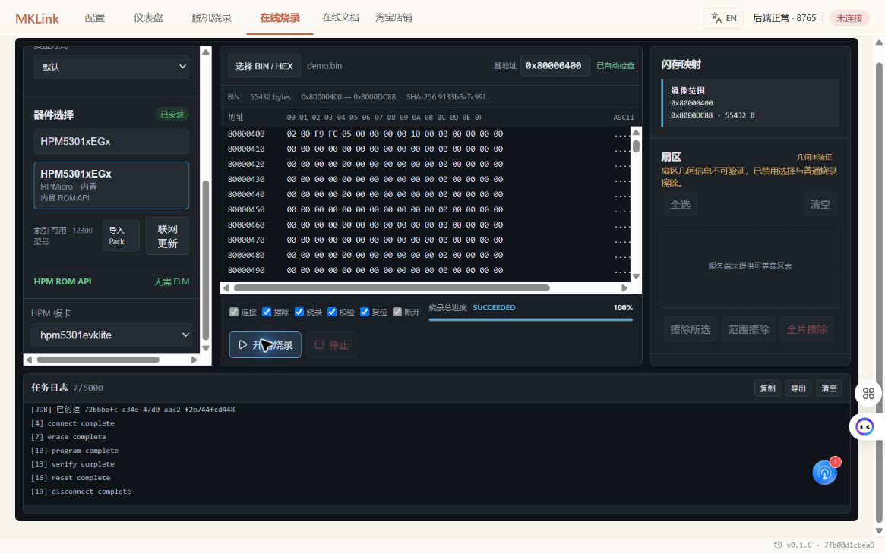
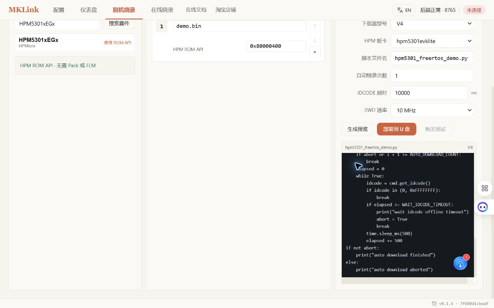
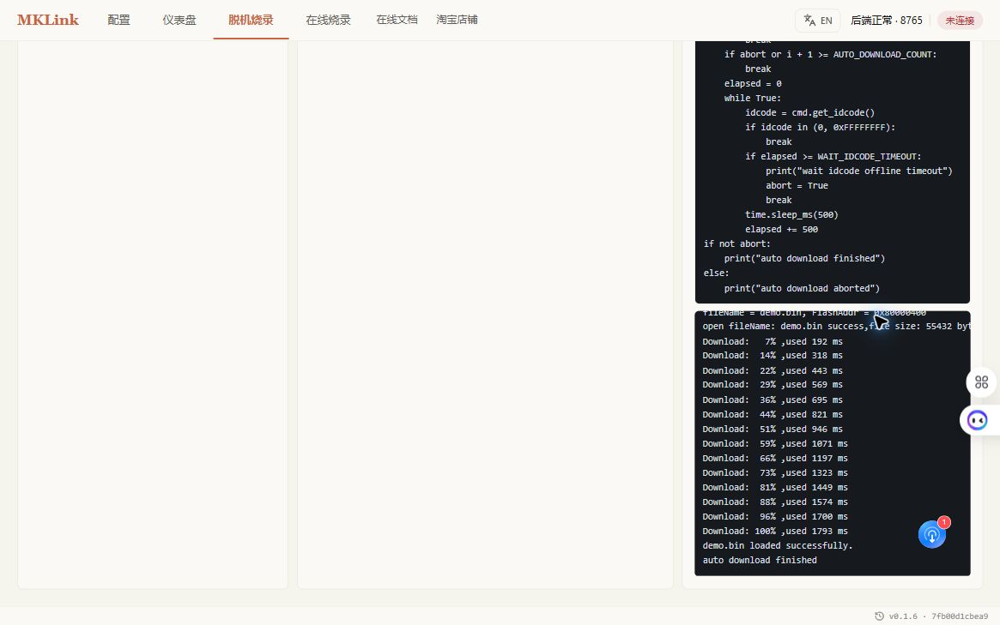
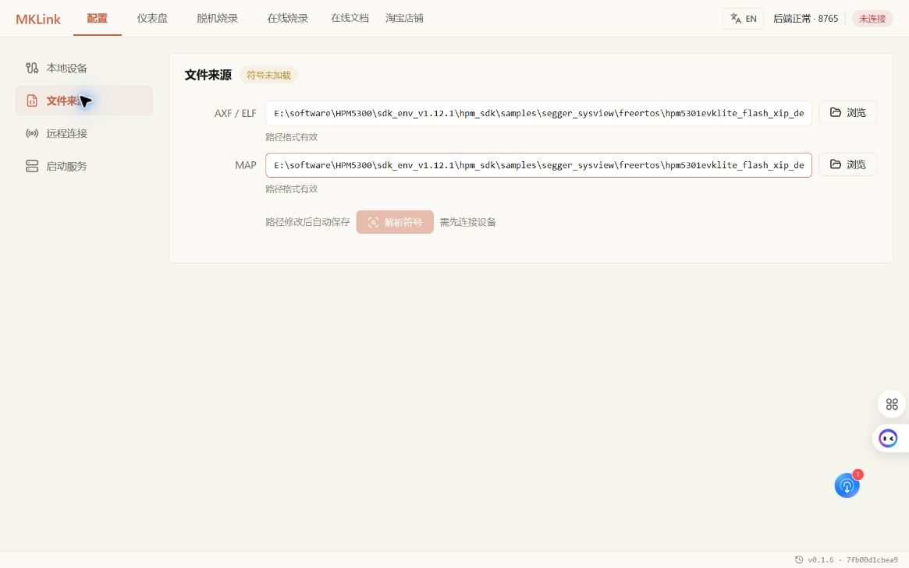
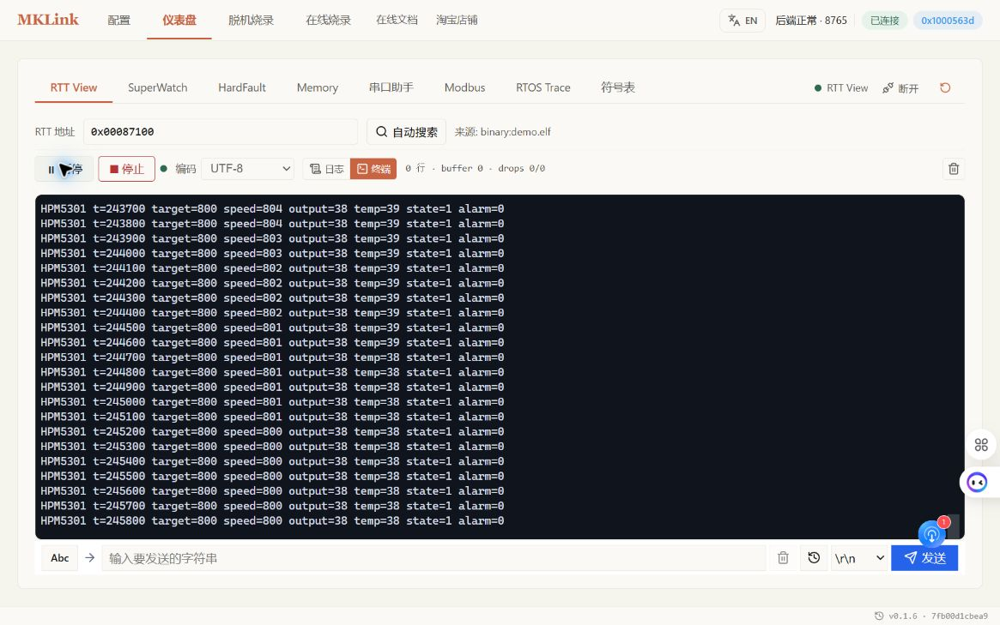
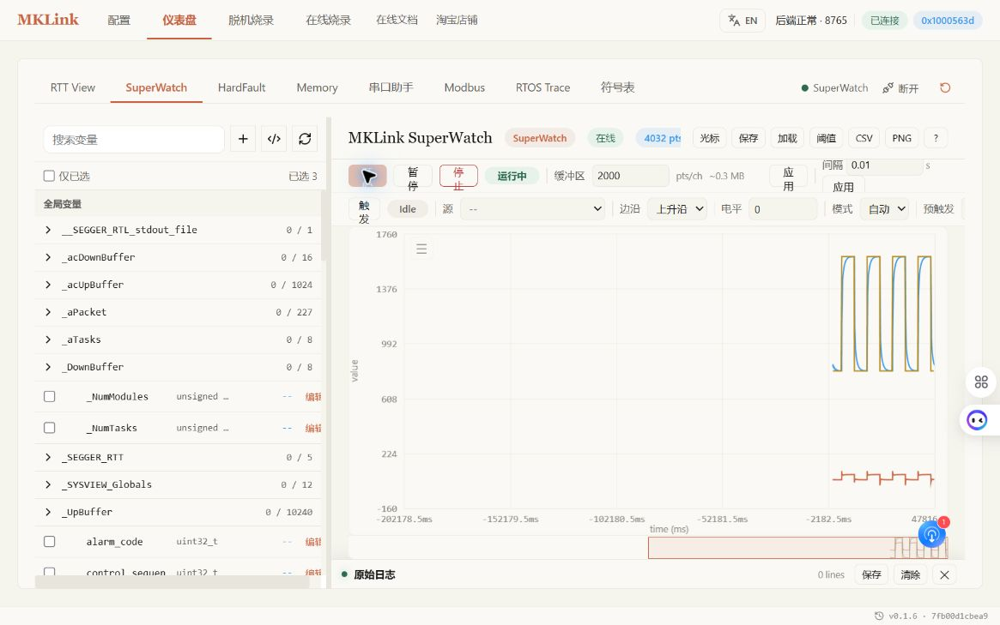
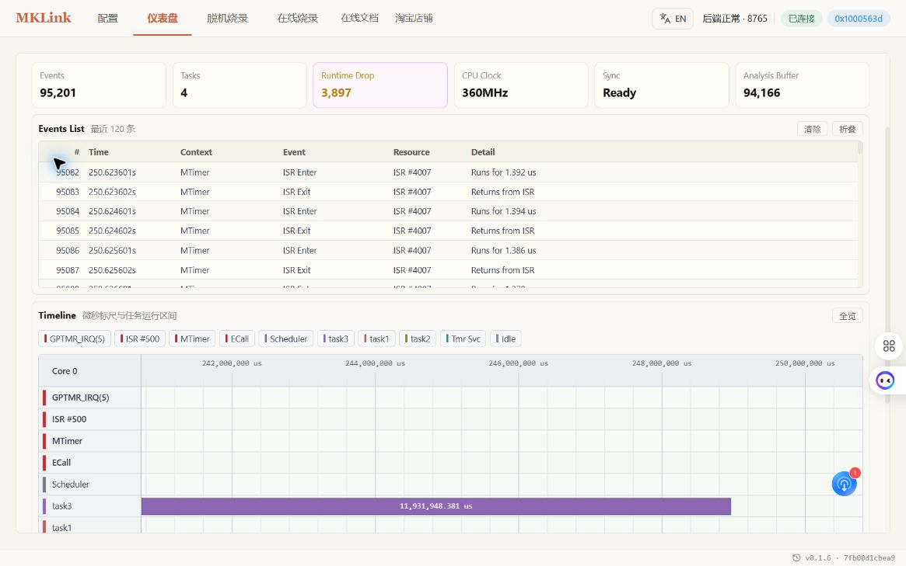
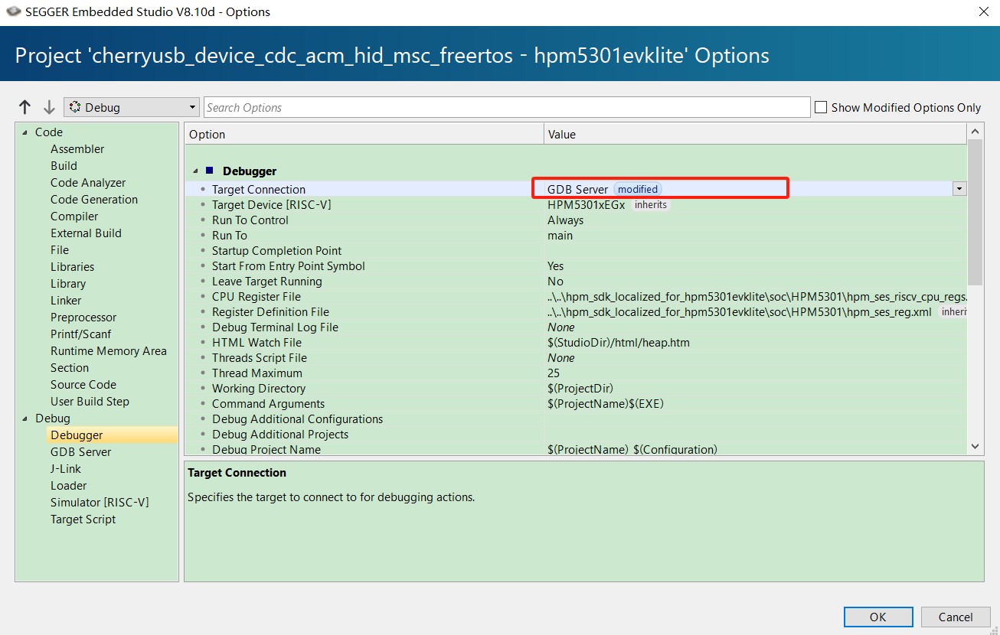
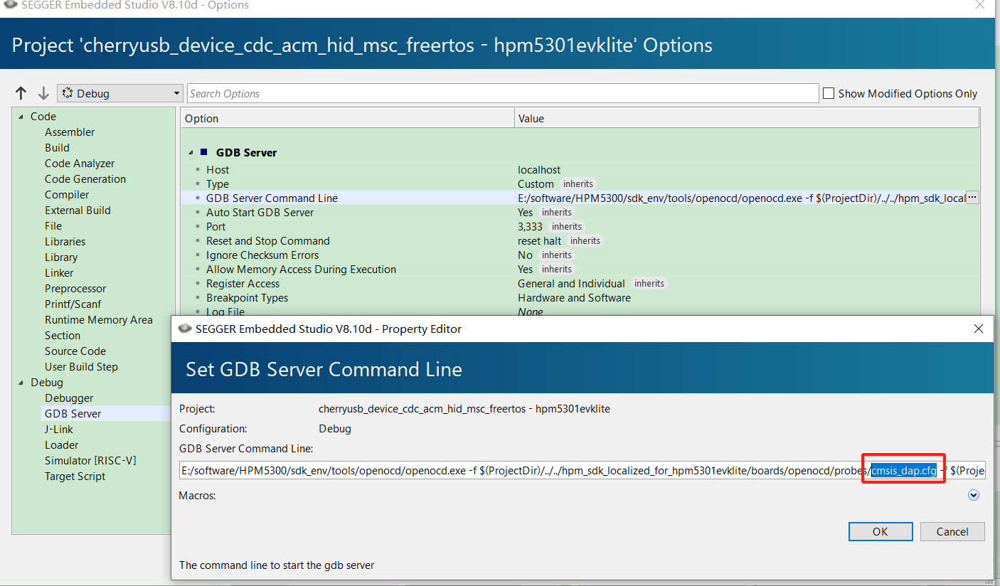
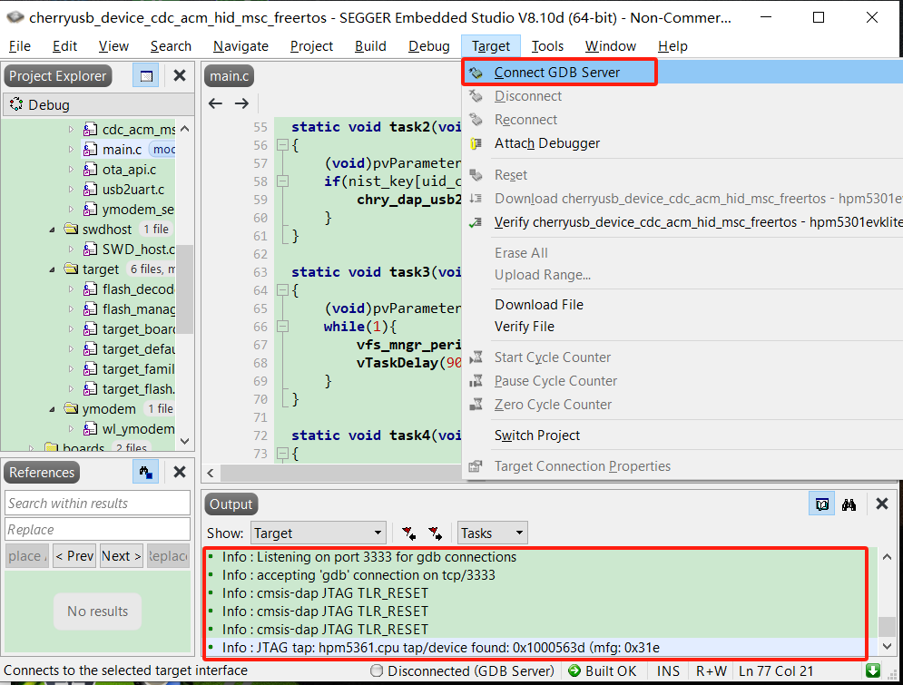

# MKLink 与先楫 HPM 生态

MKLink 支持先楫半导体 HPMicro MCU 的在线烧录、脱机烧录、CMSIS-DAP 调试、RTT 日志和 SystemView 数据采集。研发时可以在 SEGGER Embedded Studio（SES）中编译、下载和单步调试，也可以把已生成的 BIN 交给 MKLink Web GUI；进入生产阶段后，同一份已验证固件可部署到下载器中脱离电脑烧录。

本页先说明 HPM 项目与普通 Arm MCU 的差异，再给出 Web GUI 和 SES 的使用流程。完整真机案例使用 HPM5301 EVK Lite、FreeRTOS 和 SEGGER Embedded Studio 8.24，已经覆盖在线/脱机烧录、RTT、SuperWatch、VOFA+、Memory、SystemView 和 RISC-V Trap。

## HPM 下载与Arm MCU 的区别

HPM 目标由 MKLink 调用下载器设备端的 **HPM ROM API** 完成烧录，不加载 CMSIS-Pack 中的 FLM，也不能为 HPM 手工指定 FLM。开始前需要确认四项信息：

| 参数 | 要求 | 示例 |
|---|---|---|
| 目标器件 | 使用精确料号，不用工程目录名代替 | `HPM5301xEGx` |
| 固件 | 使用 HPM SDK/SES 生成的 BIN | `demo.bin` |
| 下载地址 | 以链接脚本和构建配置为准 | `0x80000400` 是常见 XIP 示例，不是通用默认值 |
| Flash 配置 | 优先选择准确的开发板名称；定制板使用经确认的四字配置 | `hpm5301evklite` |

!!! warning "地址和板型必须来自工程"
    `flash_xip`、`flash_uf2`、BootLoader 和多镜像工程的地址可能不同。不要根据相近示例猜测基地址，也不要把 ELF/AXF 当作可烧录的 BIN。使用定制 Flash 时，应从原理图、HPM SDK board 配置或已验证的量产参数取得 `hpm_flash_cfg`。

## HPM5301 实测工程

本手册使用 HPM SDK v1.12.1 `samples/segger_sysview/freertos` 作为演示工程，在保留 FreeRTOS/SystemView 的基础上增加 10 ms PID 速度环、RTT 状态帧和受控 RISC-V Trap。

| 项目 | 实测值 |
|---|---|
| 目标 | `HPM5301xEGx` |
| 板型 | `hpm5301evklite` |
| CPU 时钟 | 360 MHz |
| BIN | `demo.bin`，55,432 字节 |
| BIN 基址 | `0x80000400` |
| RTT 控制块 | `0x00087100` |
| SHA-256 | `9133B8A7...F6333DB` |

建议先阅读本页建立 HPM 下载规则，再按 [HPM5301 + FreeRTOS 全功能实战](hpm5301-freertos-case.md) 逐项操作。

## 安装并连接 Web GUI

1. 按[安装上位机与快速启动](gui-install.md)完成安装，打开真实 Web GUI；
2. 确认页面底部显示“后端正常”和当前端口；
3. 连接 MKLink 与目标板的 `JTAG/SWD`、`GND`、`Vref`，需要复位控制时连接 `RST`；
4. 在“配置”页选择工程目录和本地设备，加载本次构建生成的 ELF 与 MAP；
5. 首次连接从较低时钟开始，连接稳定后再提高速度。

ELF/MAP 用于符号、RTT 控制块和源码定位，BIN 用于 HPM 烧录。三者应来自同一次构建，重新编译后不要继续使用旧文件。

## 使用 Web GUI 在线烧录

打开“在线烧录”，按以下顺序操作：

1. 选择 MKLink 探针；
2. 搜索并选择精确 HPM 型号；
3. 选择 BIN，填写工程规定的下载基地址；
4. 选择对应开发板，定制板则填写已经验证的四字 Flash 配置；
5. 确认页面显示 `HPM ROM API`，HPM 页面不应要求选择或上传 FLM；
6. 启动作业，等待连接、编程、校验、复位和断开全部结束；
7. 用 RTT 日志、版本变量或板级行为确认新固件已经运行。

仅显示上传完成或编程进度 100% 还不够。成功记录至少应包含精确器件、BIN 摘要、基地址、板型、校验结果和复位后的运行证据。在线烧录的通用判据见[在线编译与烧录](online-flash.md)。



## 使用 Web GUI 制作 HPM 脱机任务

HPM 脱机烧录仍使用 ROM API，配置页不需要 FLM：

1. 打开“脱机烧录”，选择下载器型号；
2. 填写精确 `target_part` 和开发板名称；
3. 添加 BIN，并填写准确的下载地址；
4. 首次测试把自动烧录次数设为 1；
5. 生成预览，确认脚本使用 `hpm.board(...)` 和 `hpm.program(...)`，没有 `load.flm(...)`；
6. 部署到卷标为 `MICROKEEN` 的下载器；
7. 先在 Web GUI 点击“触发测试”，确认设备端加载成功，再用 RTT 或版本号验证目标运行；
8. 测试通过后，才改用下载器按键或机台触发。



例如 HPM5301 EVK Lite 的预览核心应类似：

```python
import hpm

hpm.board("hpm5301evklite")
hpm.program("demo.bin", 0x80000400)
```

这里的文件名、地址和板型只是格式示例，必须替换为当前项目的真实值。完整的生产记录、连续烧录和触发要求见[脱机下载与量产](offline_download.md)。

本次真机触发打开的 `demo.bin` 为 55,432 字节，进度到 100%，设备端返回 `demo.bin loaded successfully` 和 `auto download finished`。



## RTT View日志：Web GUI

HPM SDK 自带 SEGGER RTT 示例，可在不占用目标 UART 的情况下输出日志。现有 SES 示例流程如下。

1. 在 Web GUI 的“配置”页加载同一次构建的 ELF/MAP，进入“RTT View”，点击“自动搜索”后开始采集；

   

2. 看到持续输出的 HPM 示例日志，并确认复位后日志可以重新出现。

使用 Web GUI 自动搜索RTT地址，点击开始。HPM5301 实测 RTT 日志如下。采集时间覆盖 800/1600 rpm 阶跃，目标、反馈和输出持续变化。



如果自动搜索失败，依次检查固件是否初始化 RTT、ELF/MAP 是否匹配、控制块是否被链接优化，以及目标是否被其他调试会话占用。通用排查见[RTT View 日志与终端](RTT_printf.md)。

## 运行观测与故障定位

HPM 项目可以继续使用 MKLink 的通用观测能力：

- SuperWatch：根据 ELF 符号采集控制变量，观察任何全局变量的变化曲线；
- 第三方 VOFA+：MKLink 通过 SWD 采样并输出 JustFloat；
- Memory：读取 RAM、外设寄存器和关键缓冲区；
- RTOS Trace：使用 SystemView 分析 FreeRTOS 任务与 ISR；
- AI Skill：读取工程配置并调用相同能力，整理编译、烧录和运行证据。





## 在 SEGGER Embedded Studio 中下载和调试

以下内容保留原有的 HPM + SES 调试方法。MKLink 作为标准 CMSIS-DAP 探针使用，SES 通过 GDB Server/OpenOCD 与目标连接。

1. 右击工程选择 `Options`，在弹出的对话框中进入 `Debugger`，选择 `GDB Server`。

   

2. 打开 `GDB Server` 设置，在 `GDB Server Command Line` 中检查 OpenOCD 配置，将探针接口配置为 `cmsis-dap.cfg`。目标配置仍使用 HPM SDK 为当前 SoC/开发板生成的配置，不要用其他型号替代。

   

3. 连接 JTAG/SWD、GND、Vref 和必要的复位信号，在 `Target` 菜单中连接 GDB Server。连接成功后，Output 窗口应显示 OpenOCD 已识别 CMSIS-DAP 和目标核。

   

4. 执行下载或启动调试。命中 `main` 后先检查 PC、SP 和启动地址，再继续运行；调试结束时正常断开 GDB Server，释放探针给 Web GUI。

!!! note "SES 与 Web GUI 不要同时占用探针"
    SES、在线烧录、RTT、SuperWatch 和 SystemView 共用调试接口。切换工具前先停止当前会话，否则另一个入口可能显示设备忙或连接失败。


给 AI 的任务描述保持简洁即可：

> 检查 HPM 工程的精确型号、板型、BIN 和下载地址；先报告参数，再用 HPM ROM API 烧录并通过 RTT 验证运行。

## 相关资料

- [MKLink 产品与功能总览](microlink.md)
- [在线编译与烧录](online-flash.md)
- [脱机下载与量产](offline_download.md)
- [RTT View 日志与终端](RTT_printf.md)
- [HPM5301 + FreeRTOS 全功能实战](hpm5301-freertos-case.md)
- [嵌入式 AI + MKLink 使用概览](../../AI/AI.md)
- [售后服务](after-sales.md)
