# 单片机的灵魂伴侣

## 一、下载口也可以同时当串口用会有多爽

- 不需要USB 转串口工具 + 杜邦线接线
- printf直接通过下载口输出到USB虚拟串口
- 边仿真边打印，互不影响

请看在rtthread系统中使用的演示视频：

V4下载器演示视频：


V3下载器演示视频：


## 二、SEGGER RTT+ MKLink，让串口调试真正自由

在嵌入式开发中，我们总是离不开**“串口打印”**来调试。

但传统串口调试存在很多明显的痛点：

- ⚡ **速度慢**：输出数据卡顿，占用CPU时间，不能在中断中使用；
- 🔌 **硬件占用**：需要额外占用 MCU 的 UART 接口资源；
- 🔄 **接线麻烦**：需要 USB 转串口工具 + 杜邦线接线，步骤繁琐；
- 🚪 **资源受限**：串口数量有限，调试与功能常常冲突。

### 如何打破这些痛点？

**SEGGER  RTT + MKLink**完美结合了双方的优势：

- **SEGGER RTT**：提供高速、非侵入式的数据传输；
- **MKLink**：将 RTT 通道虚拟为标准 USB CDC 串口，不再占用 MCU 的串口！

**📢 让调试既拥有 RTT 的性能，又能使用任意串口助手，真正做到“即插即用，自由畅快”！**

## 三、一分钟了解 SEGGER RTT 是什么、怎么用

### 1、SEGGER RTT是什么？

RTT，全称**Real Time Transfer（实时传输）**，是一种**无需中断 MCU 程序执行**，就能实现数据与主机交互的调试技术。

它使用一种内存共享机制，将 MCU 内部的数据实时“搬运”到 PC 上。

**📦 形象理解：：**

> 就像你在 MCU 的 RAM 里放了个“邮箱”，PC 随时来收信，MCU 照常干活，互不打扰。

### 2、SEGGER RTT 的基本工作原理

🔵 **在 MCU RAM 中，有一个非常重要的结构体：**

> **_SEGGER_RTT 控制块**

🔵 **它的作用是：**

- 保存多个 **UpBuffer（MCU ➡ PC）** 和 **DownBuffer（PC ➡ MCU）** 的信息；
- 包括每个缓冲区的起始地址、大小、写指针、读指针等。

🔵 **收发数据过程：**

- **MCU发送数据** ➔ 把数据 `memcpy` 拷贝到 **UpBuffer** 的空闲区域；
- **PC接收数据** ➔ 通过MKLink 读取 UpBuffer 的数据；
- **PC发送指令** ➔ 通过MKLink 把数据写入 DownBuffer；
- **MCU读取指令** ➔ 从 DownBuffer 中 `memcpy` 出来。

由于只是内存拷贝，**整个收发过程极快，微秒级完成**，不会打断 MCU 正常工作。

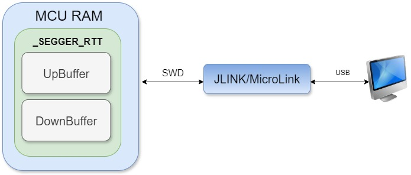

### 3、SEGGER RTT怎么用？

只需简单三步：

✅ **步骤一**：集成 RTT 源码

从 SEGGER J-Link 安装目录 `Samples/RTT` 复制以下文件到工程中，并添加头文件路径。

如我电脑上的路径：

C:\Program Files (x86)\SEGGER\JLink_V632f\Samples\RTT

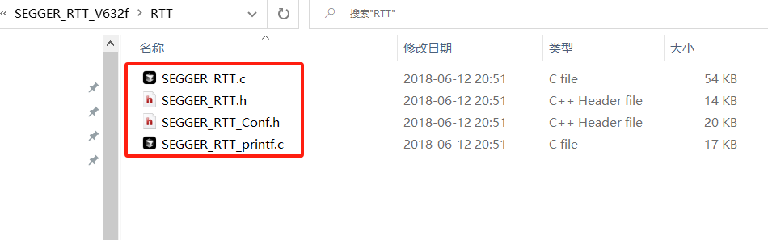

✅ **步骤二**：输出日志到 RTT

```c
#include "SEGGER_RTT.h"
int main(void)
{
    SEGGER_RTT_Init();
    SEGGER_RTT_printf(0, "hello RTT\n");   
    while(1){
        
    }
}
```

✅ **步骤三**：连接调试工具

- 如果使用传统 J-Link，只能用 RTT Viewer 上位机；
- 如果用 MKLink ，可以用**任意串口助手**直接访问 RTT 数据！

## 四、MKLink ：释放 SEGGER RTT的真正威力

**MKLink突破传统**，打通了 RTT 和通用串口调试工具之间的隔阂，直接把 RTT 数据转发到 **USB CDC 虚拟串口**，让 MCU 仿佛接了一个超级快的“软串口”！

🔵 MCU端：

- 继续使用 RTT 库发送日志，不需要改变一行代码。

🔵 MKLink端：

- 通过 USB CDC 映射成标准串口；
- 自动扫描 MCU 内存中 **_SEGGER_RTT** 控制块地址（如 0x20000000）；
- 直接读写 UpBuffer / DownBuffer；
- 完美支持双向通信！

🔵 PC端：

- 用你最喜欢的串口助手直接连 MKLink串口，爽快收发！

📷 **MKLink 数据流示意图：**


✅ **效果总结：**

- 不再局限于官方 Viewer；
- 不再受限于波特率；
- 不再需要额外串口硬件和线缆；
- 打开任意串口助手即用，极致灵活！

## 五、多种使用 SEGGER RTT 功能的方法

### 1、如何开启MKLink的SEGGER RTT功能

✅ **步骤一：找到MKLink 的 USB CDC 虚拟串口**

使用USB TypeC数据线与MKLink连接以后，电脑设备端会弹出三个设备：

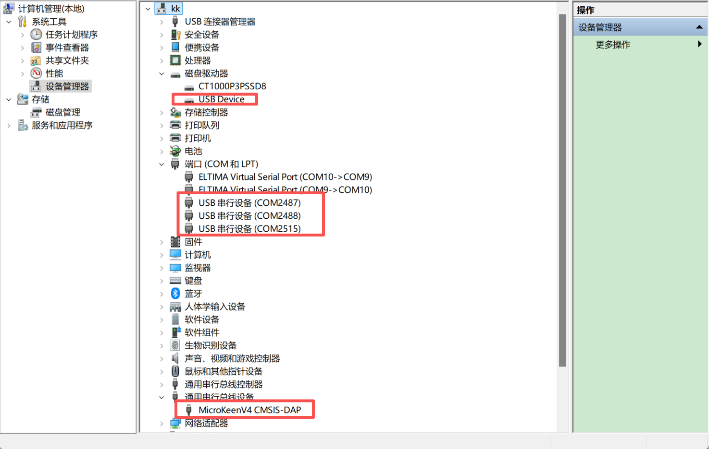

- V2和V3会弹出两个USB串行设备端口号，分别是USB转串口和虚拟串口

- V4会弹出三个USB串行设备端口号，分别是USB转串口、USB转485端口和虚拟串口

打开虚拟串口后，下载器会自动打印如下信息：

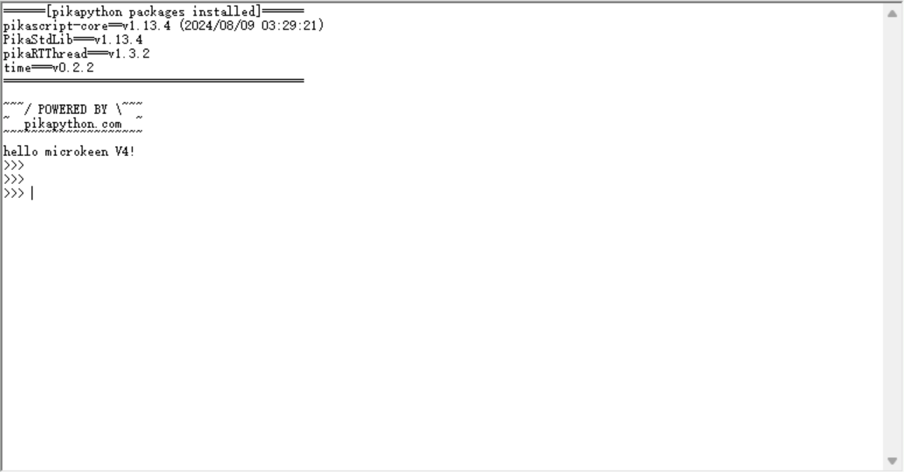

V4版本可以通过屏幕界面，来高速你打开的是什么端口，分别打开三个串口号，效果如下:


✅ **步骤二：使用串口助手类工具访问 MKLink 的 USB CDC 虚拟串口**

比如使用SSCOM，连接MicroLink的串口，输入以下指令：

```
RTTView.start(0x20000000,1024,0)
```

- 0x20000000:搜索RTT控制块的起始地址；
- 1024：搜寻范围大小；
- 0：启动RTT的通道。


**_SEGGER_RTT** 控制块地址可以通过查看MDK编译生成的.map文件来查找，如下：

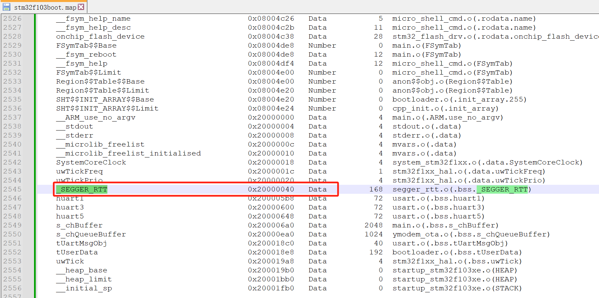

可知，\_SEGGER_RTT在地址0x20000040处，可以通过设置搜寻的地址和大小来重新启动MicroLink的RTT功能。

### 2、固定_SEGGER_RTT的地址的方法

✅ **步骤一：**打开SEGGER_RTT.c，添加红框中的代码，宏SEGGER_RTT_OPS_ADDR可以将_SEGGER_RTT的地址固定在0x20000000

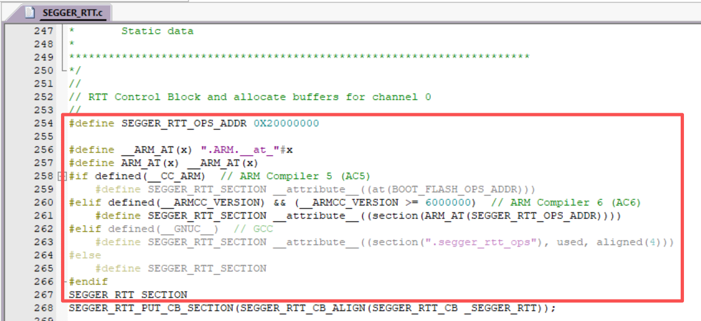

代码如下，方便直接复制：

```c
#define SEGGER_RTT_OPS_ADDR 0X20000200
#define __ARM_AT(x) ".ARM.__at_"#x
#define ARM_AT(x) __ARM_AT(x)
#if defined(__CC_ARM)  // ARM Compiler 5 (AC5)
    #define SEGGER_RTT_SECTION __attribute__((at(BOOT_FLASH_OPS_ADDR)))
#elif defined(__ARMCC_VERSION) && (__ARMCC_VERSION >= 6000000)  // ARM Compiler 6 (AC6)
    #define SEGGER_RTT_SECTION __attribute__((section(ARM_AT(SEGGER_RTT_OPS_ADDR))))
#elif defined(__GNUC__)  // GCC
    #define SEGGER_RTT_SECTION __attribute__((section(".segger_rtt_ops"), used, aligned(4)))
#else
    #define SEGGER_RTT_SECTION
#endif
SEGGER_RTT_SECTION
SEGGER_RTT_PUT_CB_SECTION(SEGGER_RTT_CB_ALIGN(SEGGER_RTT_CB _SEGGER_RTT));  
```

### 3、上电自动开启RTT功能的方法

✅ **步骤一：**打开U盘中python文件夹下的default_config.py,添加红框中的代码，下载器上电会自动执行default_config.py脚本。

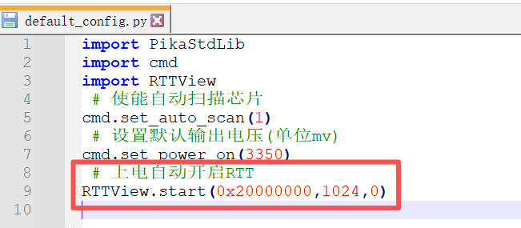


### 4、MDK中将printf重定向到RTT通道的方法

✅ **步骤一：RTE配置**

  1.打开 **RTE 配置**窗口（菜单：`Project -> Manage -> Run-Time Environment`）。

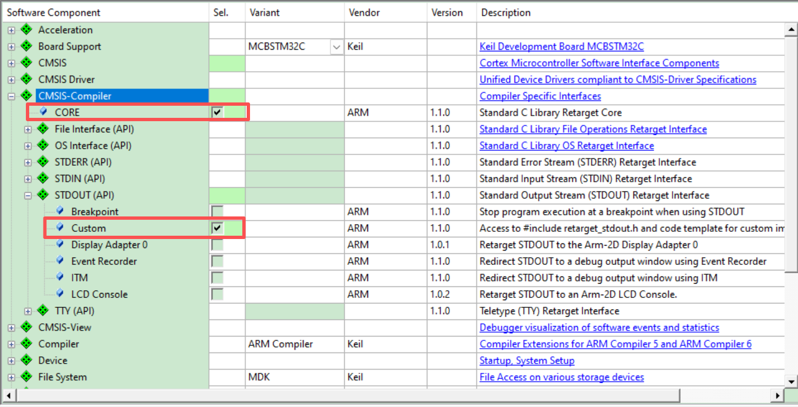

   2.勾选以下选项：

- 在 **CMSIS-Compiler** 下勾选 **CORE**；
- 在 **STDOUT(API)** 下勾选 **Custom**；

如果你在**RTE**中找不到 **CMSIS-Compiler** ，说明你的**MDK**版本较低——如果不想升级**MDK**，则可以通过下面的链接从官方直接下载对应的**cmsis-pack**：

**https://www.keil.arm.com/packs/cmsis-compiler-arm/**

或者老版本的**cmsis-pack**中，找到**Compiler**：

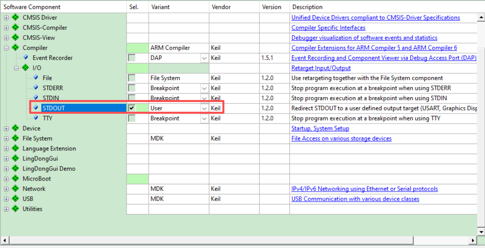

✅ **步骤二：添加stdout_putchar()**

在代码中实现 **stdout_putchar()** 函数——用它来把printf重定向到RTT通道：

```c
int stdout_putchar(int ch)
{
    SEGGER_RTT_PutChar(0, ch);
    return ch;
}
```

### 5、将rtthread系统命令行重定向到RTT通道的方法

 **方法一：安装SEGGER_RTT软件包**

SEGGER_RTT软件包是将rtthread的msh重定向到SEGGER RTT

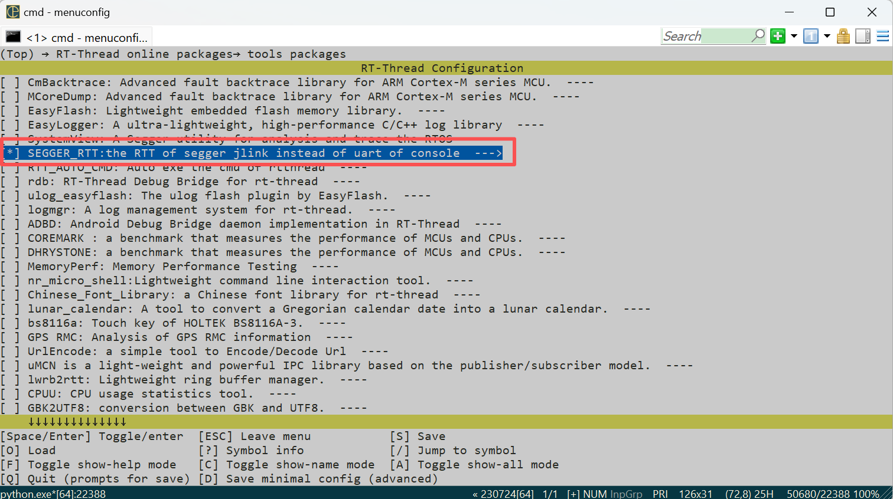

**方法二：安装agile_console软件包**

agile_console软件包可以将rtthread的msh重定向到多个端口，比如可以不影响原先uart打印的基础上，再增加一路RTT端口，比较适合两种方式需要同时使用的场景。

✅ **步骤一：安装软件包**

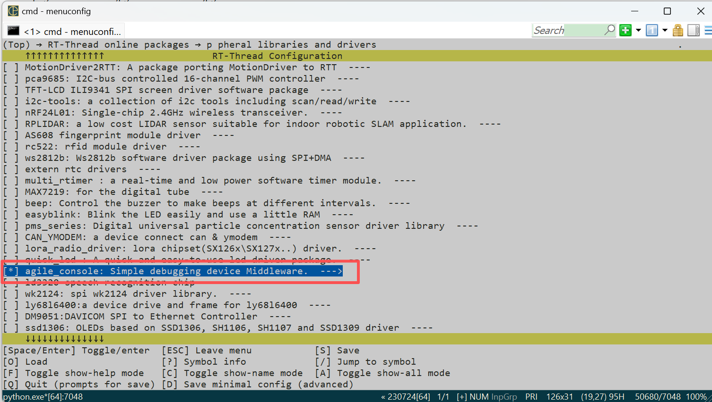

✅ **步骤二：单片机添加RTT 源码**

从 SEGGER J-Link 安装目录 `Samples/RTT` 复制以下文件到工程中，并添加头文件路径。

如我电脑上的路径：

C:\Program Files (x86)\SEGGER\JLink_V632f\Samples\RTT


✅ **步骤三：单片机添加agile软件包的适配代码**

添加一个`agile_console_rtt_be.c`文件，代码如下：

```c
#include <rtthread.h>
#include <agile_console.h>
#include "SEGGER_RTT.h"
static struct agile_console_backend _console_backend = {0};

static void rtt_backend_output(rt_device_t dev, const uint8_t *buf, int len)
{
    SEGGER_RTT_Write(0,buf,len);
}

static int rtt_backend_read(rt_device_t dev, uint8_t *buf, int len)
{
    return  SEGGER_RTT_Read(0,buf, len);	
}

static void segger_rtt_check(void)
{
    while (SEGGER_RTT_HasKey())
    {
        agile_console_wakeup();
    }
}

static int agile_console_rtt_init(void)
{
    SEGGER_RTT_Init();
    rt_thread_idle_sethook(segger_rtt_check);
	
    _console_backend.output = rtt_backend_output;
    _console_backend.read = rtt_backend_read;

    agile_console_backend_register(&_console_backend);	
    return 0;
}
INIT_BOARD_EXPORT(agile_console_rtt_init);

```

## 六、用户真实评价

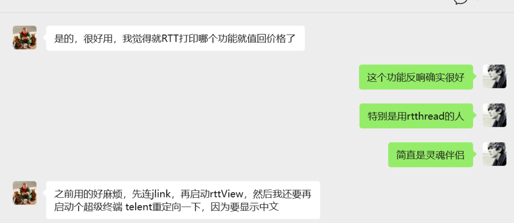

