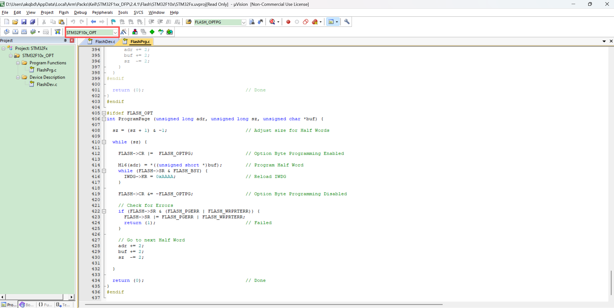
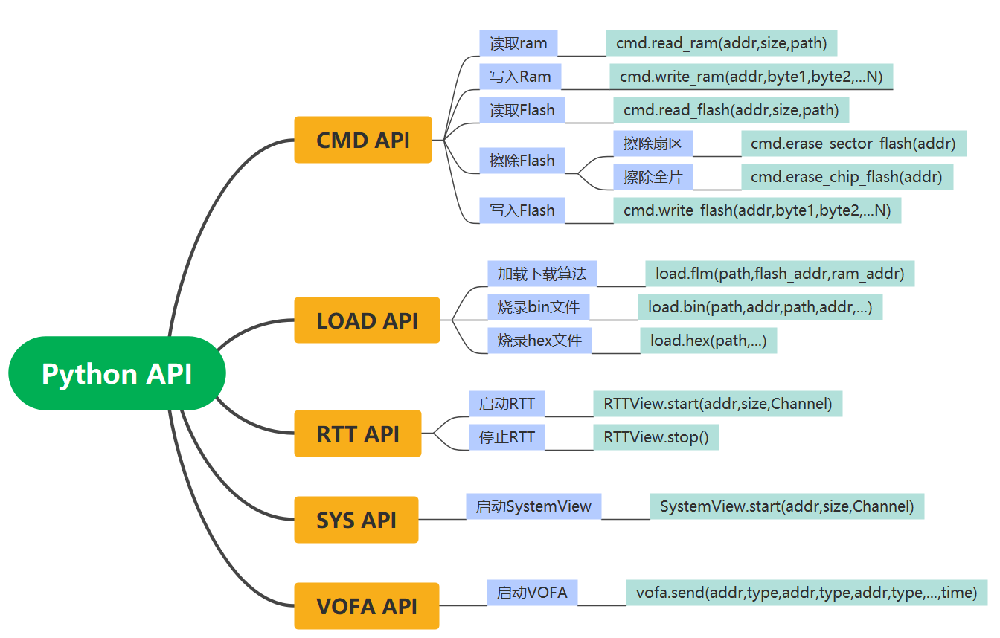

很多工程师都知道 `xxx.FLM` 下载算法可以用来烧录 Flash，但其实对于 STM32 这类器件，**Option Bytes 也可以通过专用的 `OPT.FLM` 下载算法来修改**。

方法很直接：

- 加载对应的 `OPT.FLM`
- 把 Option Bytes 区当成一段“可编程地址空间”
-  **先读取、再擦除、再写入**

以 STM32F103 为例，使用 `STM32F10x_OPT.FLM`，即可直接修改：

- RDP（读保护）
- USER 配置位
- WRP 写保护位

STM32F10x_OPT.FLM的源码在Pack包，地址一般在pack的安装目录里，如下：

`...AppData\Local\Arm\Packs\Keil\STM32F1xx_DFP\2.4.1\Flash\STM32F10x`

源码如下：



## 以 STM32F103 为例，设置读保护和解除读保护

### 1. 读取OPT字节选项

```c
 cmd.read_flash(0x1FFFF800,16)
         00 01 02 03 04 05 06 07 08 09 0A 0B 0C 0D 0E 0F
1ffff800 a5 5a ff 00 ff 00 ff 00 ff 00 ff 00 ff 00 ff 00 
```

STM32F103 选项字节基本布局：

| 偏移 | 内容   | 含义         |
| ---- | ------ | ------------ |
| 0x00 | RDP    | 读保护字节   |
| 0x01 | nRDP   | RDP反码      |
| 0x02 | USER   | 用户配置字节 |
| 0x03 | nUSER  | USER反码     |
| 0x04 | Data0  | 用户数据0    |
| 0x05 | nData0 | Data0反码    |
| 0x06 | Data1  | 用户数据1    |
| 0x07 | nData1 | Data1反码    |
| 0x08 | WRP0   | 写保护组0    |
| 0x09 | nWRP0  | WRP0反码     |
| 0x0A | WRP1   | 写保护组1    |
| 0x0B | nWRP1  | WRP1反码     |
| 0x0C | WRP2   | 写保护组2    |
| 0x0D | nWRP2  | WRP2反码     |
| 0x0E | WRP3   | 写保护组3    |
| 0x0F | nWRP3  | WRP3反码     |

**逐字节解析**

**1）0x00 = A5**

这是 **RDP（Read Protection）读保护字节**

- `0xA5` 表示：**读保护关闭（Level 0）**
- 这意味着：
  - 可以正常 SWD/JTAG 读取 Flash
  - 可以擦除、下载、调试

**对应反码**

**2）0x01 = 5A**

- `0x5A = ~0xA5`
- 这是 RDP 的校验反码
- 说明 RDP 字节有效

**3）0x02 = FF**

这是 **USER 用户配置字节**

F103 里 USER 字节主要用到几个功能位，典型包括：

- `WDG_SW`：看门狗硬件/软件选择
- `nRST_STOP`：STOP模式是否产生复位
- `nRST_STDBY`：STANDBY模式是否产生复位

```
0xFF = 1111 1111b
```

也就是这些位全为 1，表示：

**a. WDG_SW = 1**

- **独立看门狗 IWDG 由软件控制**
- 不是上电自动硬件开启
- 这一般是最常见、最安全的开发配置

**b. nRST_STOP = 1**

- **进入/退出 STOP 模式时，不产生复位**
- 即 STOP 模式不是“复位唤醒”方式

**c. nRST_STDBY = 1**

- **进入/退出 STANDBY 模式时，不产生复位**
- 实际上 STANDBY 唤醒本身会有重新启动特征，但该位保持默认未强制额外复位逻辑

其余位一般保留为 1。

**对应反码**

**4）0x03 = 00**

- `0x00 = ~0xFF`
- USER 字节反码正确

------

**5）0x04 = FF**

这是 **Data0 用户数据字节 0**

- 这是给用户自定义存储的小数据区
- 当前值：`0xFF`

**对应反码**

**6）0x05 = 00**

- `0x00 = ~0xFF`
- Data0 有效

------

**7）0x06 = FF**

这是 **Data1 用户数据字节 1**

- 也是用户自定义数据
- 当前值：`0xFF`

**对应反码**

**8）0x07 = 00**

- `0x00 = ~0xFF`
- Data1 有效

------

**9）0x08 = FF**

这是 **WRP0 写保护字节 0**

- F103 的写保护位是“**0表示保护，1表示不保护**”
- `0xFF` 表示这一组页面**全部未写保护**

**对应反码**

**10）0x09 = 00**

- `0x00 = ~0xFF`
- WRP0 正常

------

**11）0x0A = FF**

这是 **WRP1 写保护字节 1**

- `0xFF`：这一组页面**也全部未写保护**

**对应反码**

**12）0x0B = 00**

- `0x00 = ~0xFF`
- WRP1 正常

------

**13）0x0C = FF**

这是 **WRP2 写保护字节 2**

- `0xFF`：这一组页面**也全部未写保护**

**对应反码**

**14）0x0D = 00**

- `0x00 = ~0xFF`
- WRP2 正常

------

**15）0x0E = FF**

这是 **WRP3 写保护字节 3**

- `0xFF`：这一组页面**也全部未写保护**

**对应反码**

**16）0x0F = 00**

- `0x00 = ~0xFF`
- WRP3 正常

### 2.设置读保护字节

在 **STM32F103** 上写入读保护，本质上就是把 **Option Byte 里的 RDP** 从 `0xA5` 改成 **任意非 `0xA5` 的值**。

最常见做法就是写成：

```
RDP = 0x00
nRDP = 0xFF
```

1. 先加载opt.flm下载算法

```c
load.flm("FLM/STM32F10x_OPT.FLM",0x08000000,0x20000000)
```

2. 擦除opt选项字节

```c
cmd.erase_sector_flash(0x1FFFF800)
```

3. 写入读保护

```c
cmd.write_flash(0x1FFFF800,0X00,0XFF,0XFF,0X00,0XFF,0X00,0XFF,0X00,0XFF,0X00,0XFF,0X00,0XFF,0X00,0XFF,0X00)
```

4. 写入读保护后，重新上电才会生效

### 2.解除读保护字节

1. 先加载opt.flm下载算法

```c
load.flm("FLM/STM32F10x_OPT.FLM",0x08000000,0x20000000)
```

2. 擦除opt选项字节

```c
cmd.erase_sector_flash(0x1FFFF800)
```

3. 解除读保护

```c
cmd.write_flash(0x1FFFF800,0Xa5,0X5a,0XFF,0X00,0XFF,0X00,0XFF,0X00,0XFF,0X00,0XFF,0X00,0XFF,0X00,0XFF,0X00)
```

4. 解除读保护后，重新上电才会生效

*<u>**说明：本文仅用于原理性分析与技术交流，不构成实际操作指导。涉及芯片安全配置（如读保护）的操作具有不可逆风险，可能导致程序擦除或设备损坏。非专业人员请勿自行尝试，由此产生的任何后果概不负责。**</u>*

本列表汇总了 MKLink 常用的 Python API 接口

---



## 1.cmd api列表

### 1.1 读取Ram数据

`cmd.read_ram(addr,size,path)`

**参数**:

- `addr`：读取地址
- `size`：读取的字节数
- `path`：可选参数，保存数据到文件系统

**示例**:

- `cmd.read_ram(0x20000000,128)`
- `cmd.read_ram(0x20000000,128,"ram.bin")`

**注意：数据保存到文件后，需要重启下载器，U盘中才能刷新出新文件**

```c++
cmd.read_ram(0x20000000,128)
         00 01 02 03 04 05 06 07 08 09 0A 0B 0C 0D 0E 0F
20000000 01 00 00 00 00 00 00 00 00 00 00 00 04 1a 00 20 
20000010 01 00 00 00 00 00 00 00 00 a2 4a 04 01 00 00 00 
20000020 0f 00 00 00 00 00 00 00 00 00 00 00 00 00 00 00 
20000030 00 00 00 00 00 00 00 00 00 00 00 00 00 00 00 00 
20000040 53 45 47 47 45 52 20 52 54 54 00 00 00 00 00 00 
20000050 03 00 00 00 03 00 00 00 8b 49 00 08 f8 00 00 20 
20000060 00 04 00 00 00 00 00 00 00 00 00 00 00 00 00 00 
20000070 00 00 00 00 00 00 00 00 00 00 00 00 00 00 00 00 
```

### 1.2 写入Ram数据

`cmd.write_ram(addr,byte1,byte2,byte3,byte4,...N)`

**参数**:

- `addr`：写入地址
- `byte`：N 个待写入的字节数据

**示例**:

- cmd.write_ram(0x20001000,0xA5,0x5A)

```c++
cmd.write_ram(0x20001000,0xA5,0x5A)
         00 01 02 03 04 05 06 07 08 09 0A 0B 0C 0D 0E 0F
20001000 a5 5a 
    
cmd.read_ram(0x20001000,2)
         00 01 02 03 04 05 06 07 08 09 0A 0B 0C 0D 0E 0F
20001000 a5 5a 
```


### 1.3 读取Flash数据

`cmd.read_flash(addr,size,path)`

**参数**:

- `addr`：读取地址
- `size`：读取的字节数
- `path`：可选参数，保存数据到文件系统

**示例**:

- `cmd.read_flash(0x08000000,128)`
- `cmd.read_flash(0x08000000,128,"flash.bin")`

**注意：数据保存到文件后，需要重启下载器，U盘中才能刷新出新文件资源。**

```c++
cmd.read_flash(0x08000000,128)
         00 01 02 03 04 05 06 07 08 09 0A 0B 0C 0D 0E 0F
08000000 b0 1f 00 20 49 01 00 08 f1 0f 00 08 e9 0f 00 08 
08000010 ed 0f 00 08 1d 09 00 08 fd 0f 00 08 00 00 00 00 
08000020 00 00 00 00 00 00 00 00 00 00 00 00 f5 0f 00 08 
08000030 1f 09 00 08 00 00 00 00 f3 0f 00 08 f7 0f 00 08 
08000040 63 01 00 08 63 01 00 08 63 01 00 08 63 01 00 08 
08000050 63 01 00 08 63 01 00 08 63 01 00 08 63 01 00 08 
08000060 63 01 00 08 63 01 00 08 63 01 00 08 63 01 00 08 
08000070 63 01 00 08 63 01 00 08 63 01 00 08 63 01 00 08 
```

### 1.4 擦除Flash扇区

- 擦除扇区：`cmd.erase_sector_flash(addr)`

- 整片擦除：`cmd.erase_chip_flash(addr)`

**参数**:

- `addr`：扇区地址，必须对齐扇区

**示例**:

- cmd.erase_sector_flash(0x08005000)
- cmd.erase_chip_flash(0x08000000)

**注意：擦写flash 需要调用flash下载算法的函数接口，所以需要先使用load.flm()加载flash下载算法**

```c++
load.flm("FLM/STM32F10x_1024.FLM",0x08000000,0x20000000)
0
>>> 
cmd.erase_sector_flash(0x08005000)
0
cmd.erase_chip_flash(0x08000000)
0    
>>> 
```

### 1.5 写入Flash数据

`cmd.write_flash(addr,byte1,byte2,byte3,byte4,...N)`

**参数**:

- `addr`：写入地址
- `byte`：N 个待写入的字节数据

**示例**:

- cmd.write_flash(0x08005000,0xA5,0x5A)

**注意：擦写flash 需要调用flash下载算法的函数接口，所以需要先使用load.flm()加载flash下载算法**

```c++

cmd.write_flash(0x08005000,0xA5,0x5A)
         00 01 02 03 04 05 06 07 08 09 0A 0B 0C 0D 0E 0F
08005000 a5 5a 
    
cmd.read_flash(0x08005000,16)
         00 01 02 03 04 05 06 07 08 09 0A 0B 0C 0D 0E 0F
08005000 a5 5a ff ff ff ff ff ff ff ff ff ff ff ff ff ff 
```

## 2 load api列表

### 2.1 加载下载算法

`load.flm(path,flash_addr,ram_addr)`

**参数**:

- `path`：FLM文件的目录
- `flash_addr`：flash的基地址
- `ram_addr`：ram的基地址

**示例**:

- load.flm("FLM/STM32F10x_1024.FLM",0x08000000,0x20000000)

```c
load.flm("FLM/STM32F10x_1024.FLM",0x08000000,0x20000000)
0
```

### 2.2 烧录bin文件

`load.bin(path,addr,path,addr,...)`

**参数**:

- `path`：bin文件目录
- `addr`：addr烧录地址
- 可选参数，可依次烧录多个文件到不同地址

**示例**:

- load.bin("bootloader.bin",0x08000000,"app.bin",0x08005000)

```c
 load.bin("bootloader.bin",0x08000000,"app.bin",0x08005000)
fileName bootloader.bin, Addr 0x8000000
Download:   5% ,used 234 msDownload:  11% ,used 508 msDownload:  17% ,used 780 msDownload:  23% ,used 1053 msDownload:  29% ,used 1327 msDownload:  34% ,used 1600 msDownload:  40% ,used 1873 msDownload:  46% ,used 2147 msDownload:  52% ,used 2421 msDownload:  58% ,used 2694 msDownload:  63% ,used 2967 msDownload:  69% ,used 3241 msDownload:  75% ,used 3514 msDownload:  81% ,used 3788 msDownload:  87% ,used 4062 msDownload:  93% ,used 4335 msDownload:  98% ,used 4609 msDownload: 100% ,used 4686 ms
 /bootloader.bin loaded success.
fileName app.bin, Addr 0x8005000
Download:   2% ,used 234 msDownload:   5% ,used 507 msDownload:   8% ,used 779 msDownload:  11% ,used 1053 msDownload:  13% ,used 1327 msDownload:  16% ,used 1600 msDownload:  19% ,used 1874 msDownload:  22% ,used 2147 msDownload:  24% ,used 2421 msDownload:  27% ,used 2694 msDownload:  30% ,used 2968 msDownload:  33% ,used 3241 msDownload:  35% ,used 3514 msDownload:  38% ,used 3788 msDownload:  41% ,used 4062 msDownload:  44% ,used 4336 msDownload:  46% ,used 4609 msDownload:  49% ,used 4881 msDownload:  52% ,used 5154 msDownload:  55% ,used 5428 msDownload:  57% ,used 5701 msDownload:  60% ,used 5974 msDownload:  63% ,used 6248 msDownload:  66% ,used 6521 msDownload:  68% ,used 6795 msDownload:  71% ,used 7069 msDownload:  74% ,used 7342 msDownload:  77% ,used 7616 msDownload:  79% ,used 7890 msDownload:  82% ,used 8163 msDownload:  85% ,used 8437 msDownload:  88% ,used 8710 msDownload:  90% ,used 8984 msDownload:  93% ,used 9257 msDownload:  96% ,used 9531 msDownload:  99% ,used 9805 msDownload: 100% ,used 9882 ms
 /app.bin loaded success.
```

### 2.3 烧录hex文件

`load.hex(path,...)`

**参数**:

- `path`：hex文件目录
- 可选参数，可依次烧录多个文件到不同地址

**示例**:

- load.hex("bootloader.hex","app.hex")

```c
load.hex("bootloader.hex","app.hex")
fileName bootloader.hex
Download:   7% ,used 44 ms Download:  15% ,used 208 ms Download:  22% ,used 371 ms Download:  30% ,used 424 ms Download:  37% ,used 588 ms Download:  45% ,used 751 ms Download:  52% ,used 804 ms Download:  60% ,used 967 ms Download:  67% ,used 1131 ms Download:  75% ,used 1294 ms Download:  82% ,used 1347 ms Download:  90% ,used 1510 ms Download:  97% ,used 1674 ms Download: 100% ,used 1726 ms 
 /bootloader.hex loaded success
fileName app.hex
Download:   2% ,used 48 ms Download:   4% ,used 212 ms Download:   6% ,used 375 ms Download:   8% ,used 428 ms Download:  10% ,used 591 ms Download:  12% ,used 755 ms Download:  14% ,used 808 ms Download:  16% ,used 971 ms Download:  18% ,used 1134 ms Download:  20% ,used 1298 ms Download:  22% ,used 1351 ms Download:  24% ,used 1514 ms Download:  26% ,used 1678 ms Download:  28% ,used 1731 ms Download:  31% ,used 1894 ms Download:  33% ,used 2057 ms Download:  35% ,used 2221 ms Download:  37% ,used 2274 ms Download:  39% ,used 2437 ms Download:  41% ,used 2601 ms Download:  43% ,used 2654 ms Download:  45% ,used 2817 ms Download:  47% ,used 2981 ms Download:  49% ,used 3144 ms Download:  51% ,used 3197 ms Download:  53% ,used 3360 ms Download:  55% ,used 3524 ms Download:  57% ,used 3577 ms Download:  59% ,used 3740 ms Download:  62% ,used 3904 ms Download:  64% ,used 4067 ms Download:  66% ,used 4120 ms Download:  68% ,used 4283 ms Download:  70% ,used 4447 ms Download:  72% ,used 4500 ms Download:  74% ,used 4663 ms Download:  76% ,used 4827 ms Download:  78% ,used 4990 ms Download:  80% ,used 5043 ms Download:  82% ,used 5206 ms Download:  84% ,used 5370 ms Download:  86% ,used 5423 ms Download:  88% ,used 5586 ms Download:  90% ,used 5750 ms Download:  93% ,used 5803 ms Download:  95% ,used 5966 ms Download:  97% ,used 6130 ms Download:  99% ,used 6293 ms Download: 100% ,used 6345 ms 
 /app.hex loaded success
0
```

## 3 SEGGER RTT api列表

### 3.1 启动RTT

RTTView.start(addr,size,Channel)

**参数**:

- `addr`：_SEGGER_RTT控制块的地址
- size，搜寻范围
- Channel，指定RTT的通道

**示例**:

- RTTView.start(0x20000200,1024,0)

```c
RTTView.start(0x20000200,1024,0)
Find SEGGER RTT addr 0x20000200
UpBuffer Channel 0 Size: 2048 Mode: 0
UpBuffer Channel 1 Size: 0 Mode: 0
UpBuffer Channel 2 Size: 0 Mode: 0
DownBuffer Channel 0 Size: 16 Mode: 0
DownBuffer Channel 1 Size: 0 Mode: 0
DownBuffer Channel 2 Size: 0 Mode: 0
```

### 3.2 停止RTT

`RTTView.stop()`

## 4 SEGGER SystemView api列表

### 4.1 启动SystemView

`SystemView.start(addr,size,Channel)`

**参数**:

- `addr`：_SEGGER_RTT控制块的地址
- size，搜寻范围
- Channel，指定RTT的通道

**示例**:

- SystemView.start(0x20000200,1024,1)

```c
>>> SystemView.start(0x20000200,1024,1)
Addr = 0x20000200,wSize = 1024,Channel = 1
Find SEGGER RTT addr 0x20000200
UpBuffer Channel 0 Size: 2048 Mode: 0
UpBuffer Channel 1 Size: 0 Mode: 0
UpBuffer Channel 2 Size: 0 Mode: 0
DownBuffer Channel 0 Size: 16 Mode: 0
DownBuffer Channel 1 Size: 0 Mode: 0
DownBuffer Channel 2 Size: 0 Mode: 0
```

## 4 VOFA+ api列表

### 4.1 启动VOFA

vofa.send(addr,type,addr,type,addr,type,...,time)

**参数**:

- addr：变量的地址
- type，变量的类型
- 周期，读取周期，单位秒，0为停止

**示例**:

- vofa.send(0x20000030,"uint8_t",0x2000154c,"float",0x20001550,"float",0.00001)

